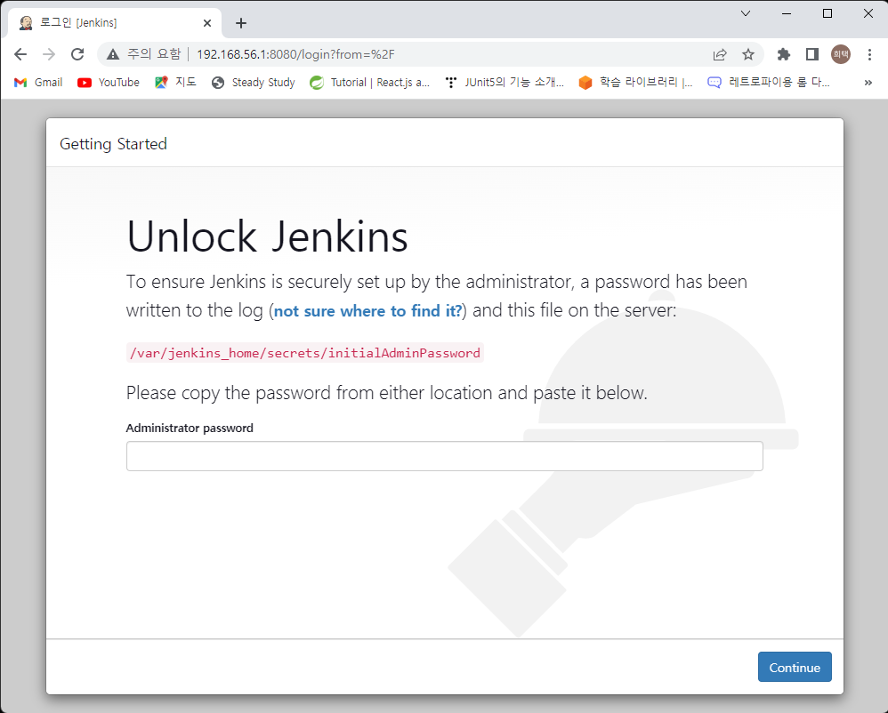
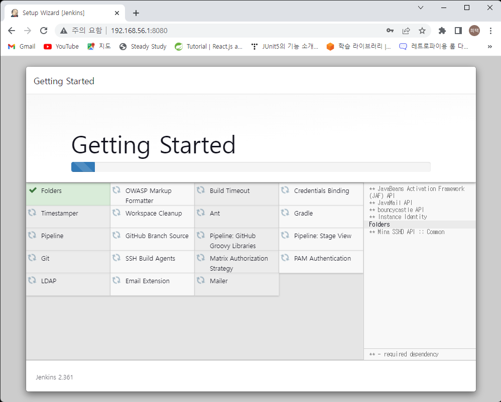
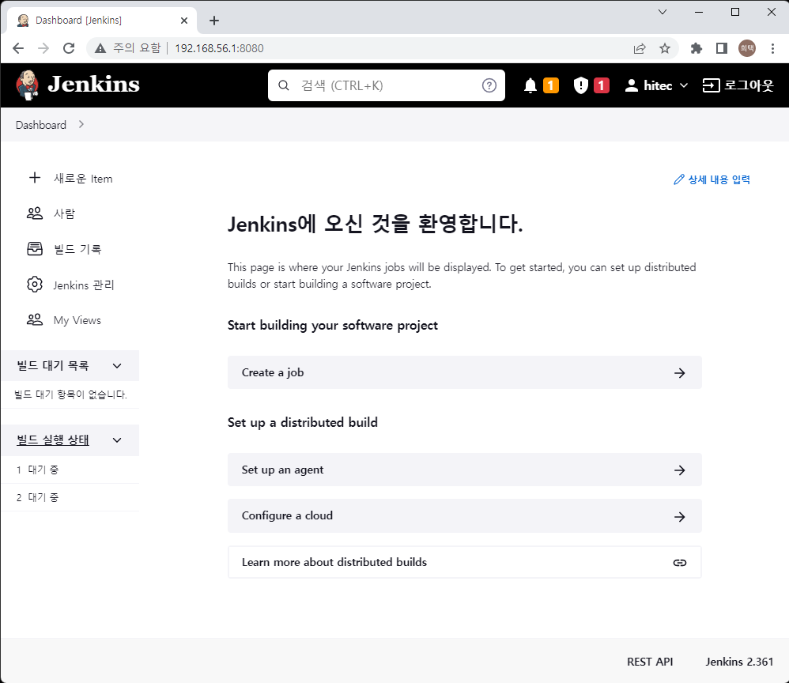

# Jenkins를 활용한 CI/CD

## 1. Jenkins 설치 (Docker)

1. Jenkins Docker 로 기동
    ```
    sudo docker run -d -p 8080:8080 -p 50000:50000 --restart=on-failure --name hitec-jenkins jenkins/jenkins:jdk11
    ```
    > -d 옵션 : daemon으로 실행   
    > -p 옵션 : port fowarding (앞 포트번호를 뒤 포트번호로 접근)   
    > --restart : 재기동 조건   
    > --name : 컨테이너의 이름

2. windows 에서 브라우저로 jenkins 열기
    > 윈도우즈에서 가상머신에서 기동중이 서비스에 접근하기 위해선   
    > virtualbox 의 포트 포워딩이 필요(우분투설치의 네트워크 설정 참조 포트는 8080)   

       

3. unlock jenkins
    > Administartor password 를 넣어 jenkins unlock   
    > Administrator password 설치 로그에서 확인 

    ```
    sudo docker logs hitec-jenkins
    ```

        

    > Please use the following password to proceed to installation 항목 확인   

4. suggested plugins 설치
        
    > jenkins를 잘 안다면 필요한 플러그인만 설치   
    > 제안하는 플러그인은 왠만하면 다 필요해 보임    

5. 어드민 계정 생성
        
    >계정명, 암호, 이름, 이메일주소를 입력하고 continue

6. 설치 완료
        
