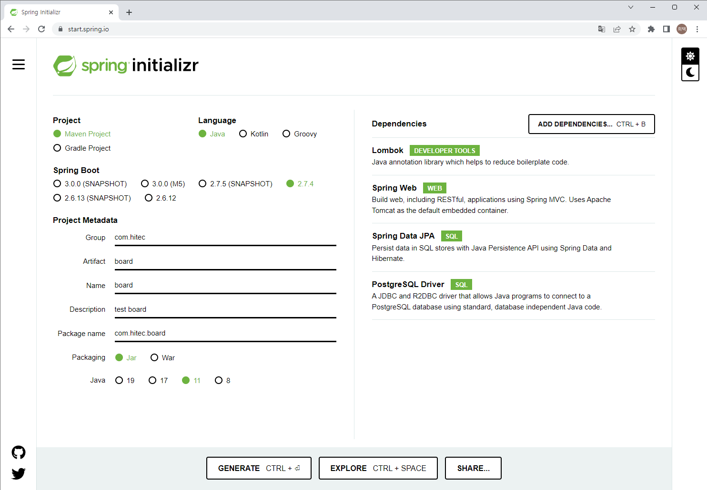

# Spring Boot 게시판 만들기   
    심플한 게시판을 만들어보자.   
    서버 API는 Restful 하게 설계를 하고 화면은 spa 로 개발해보기로 한다.    
    저장소는 postgresql 을 사용하기로 한다.   
    spring webmvc를 사용하고 jpa를 사용해보자

1. PostgreSql 실행 (docker)
    > 개발을 위한 DB 실행으로 운영에서는 운영을 위한 구조가 필요  

    ```
    sudo docker run --name hitecboarddb -p 5432:5432 -e POSTGRES_USER=hitec -e POSTGRES_PASSWORD=1234 -e POSTGRES_DB=hitecboard -d postgres
    ```
    Docker로 PostgreSql DB를 실행시킨다. 

    > POSTGRES_PASSWORD - 데이터베이스 비밀번호   
    > POSTGRES_USER - 데이터베이스 사용자   
    > POSTGRES_DB - 데이터베이스 스키마   

2. 프로젝트 생성

    프로젝트 설정을 하고
    spring web, spring data jpa, postgresql driver를 디펜던시로 설정한다. 

       

    Generate 버튼을 클릭해서 초기 설정 프로젝트를 다운로드 한다.    

    다운로드 받은 파일을 적당한 위치에 압축을 풀고 VSCode로 연다.   

3. Spring 설정    
    application.properties 파일을 application.yml 파일로 변경   

    ```yaml
    spring:
        datasource:
            url: jdbc:postgresql://192.168.56.1:5432/hitecboard
            username: hitec
            password: 1234
            driver-class-name: org.postgresql.Driver
        jpa:
            show-sql: true
            hibernate:
            ddl-auto: create
            database-platform: org.hibernate.dialect.PostgreSQLDialect
    logging.level:
        org.hibernate.SQL: debug
    ``` 

4. Modeling   
    model 이라는 이름으로 디렉토리를 생성한다.   
    DB 의 테이블과 매칭이 되는 java 클래스 파일을 생성한다. 

    예제에서는 작성한 글을 저장하는 게시판 테이블을 우선 만들어보자

    ```java
    //Board.java
    @Entity
    @Table(name = "board")
    public class Board{

        @Id
        @GeneratedValue(strategy = GenerationType.AUTO)
        private long id;

        @Column(name = "title")
        private String title;

        @Column(name = "content")
        private String content;
    }
    ```

5. Repository   
    repository 라는 이름으로 디렉토리를 생성한다.   
    DB 와 연결해서 모델에 정의된 형태로 CRUD 를 실행한다.    

    ```java
    //BoardRepository.java
    ```

6. Service   
    service 라는 이름으로 디렉토리를 생성한다.    
    Repository 를 통해 CRUD를 수행한다. 

    ```java
    //BoardService.java
    ```

7.  Controller   
    web 이라는 이름으로 디렉토리를 생성한다.    
    web을 통해 api를 요청을 처리한다. 
    ```java
    //BoardController.java
   ```