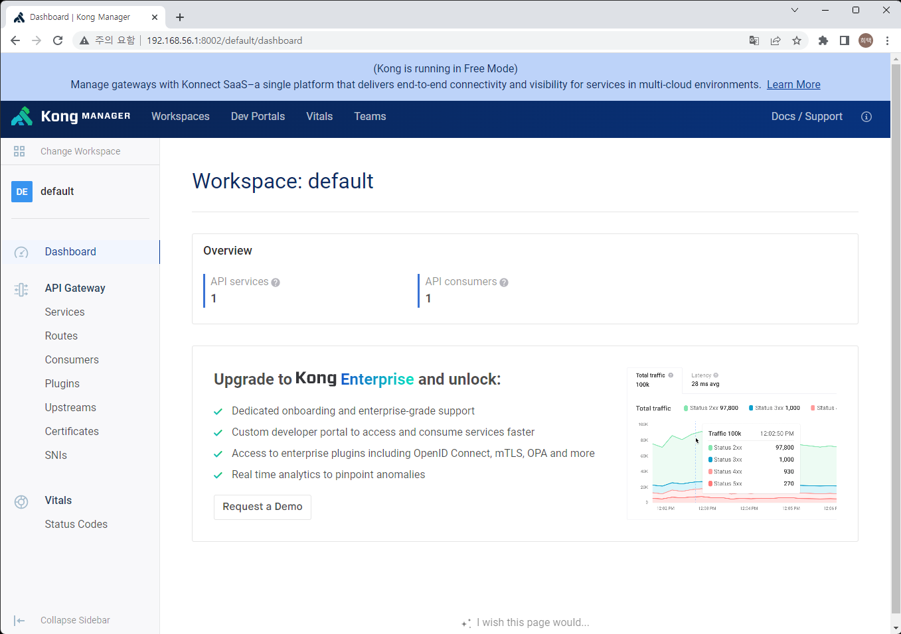
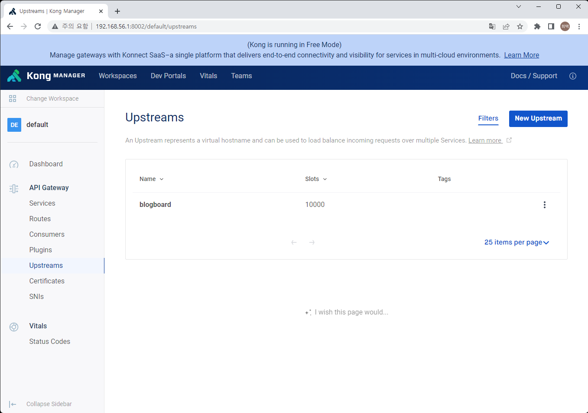
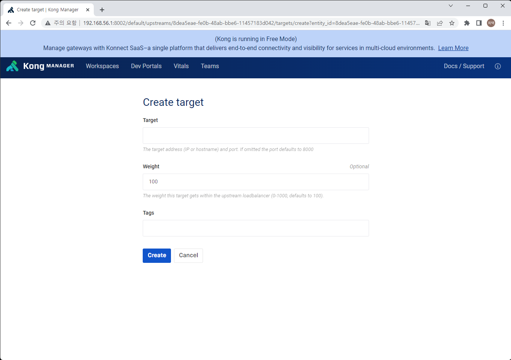
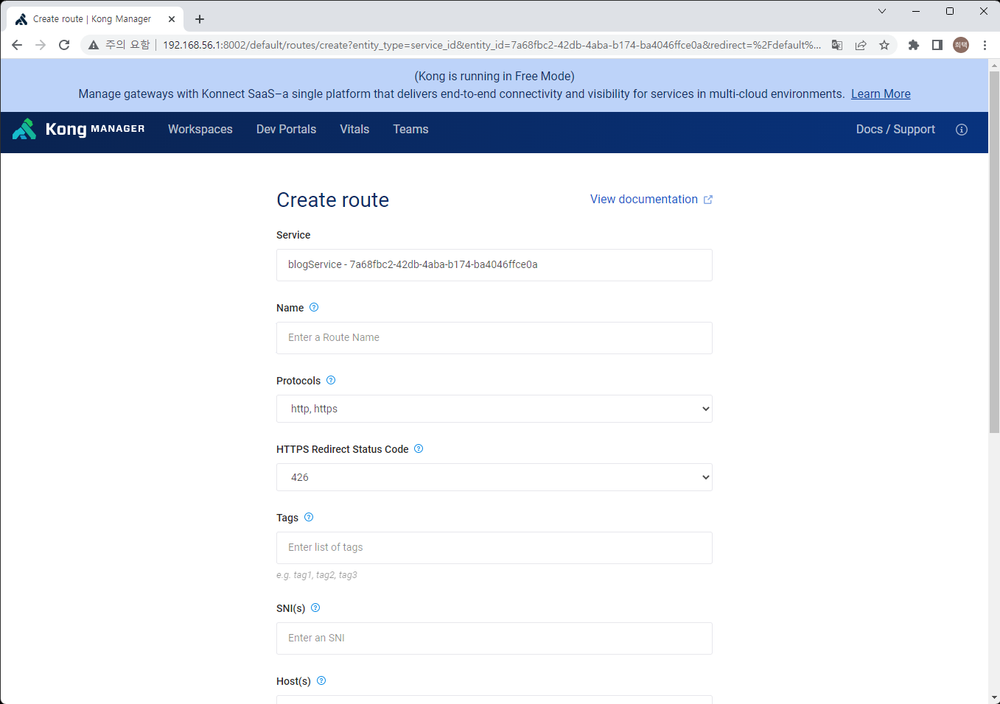

# API Gateway 인 Kong 과 개발 한 서버 연동     

> Kong Manager를 통해 컨테이너화 된 front 리소스 서버와 board java 웹 어플리케이션을 설정한다.    
> front 리소스 서버는 인증의 절차가 필요없으며, board 서버는 인증의 절차가 필요하다.      

> Kong 설정은 upstream 등록, Service 등록, Routes 등록, 인증플러그인 설정 의 순서로 진행한다.    

1. Kong 
    1. Routes -> Kong으로 들어오는 요청에 대한 정의 Reuqest 에 대해 route 하는 Service 를 정한다.    
    2. Service -> 서비스로 특정지을 수 있는 단위, upstream 을 통해 실제 api 서버에 요청 할 수 있다.    
    3. upstream -> 실제 api 서버인 타겟을 여러개 둘 수 있고, 로드발란싱 등을 수행 할 수 있다.    
    4. plugin -> 인증, 인가, 보안, Traffic control, logging, 모니터링 등은 plugin을 통해 설정할 수 있다.    

2. upstream 설정   
    1. Kong Manager 에서 Workspaces 탭을 선택하고 default workspace를 선택     
        
    2. 좌측 메뉴에서 Upstreams 선택 -> 우측 상단의 New Upstream 선택   
        
    Name을 설정하고 Save 버튼을 통해 저장     
        
    3. 리스트에서 새로 생성한 upstream 을 선택 -> 좌측의 Targets 를 선택 -> 우측상단의 NewTarget 을 선택   
        
    target 항목에 실제 API 서버의 host와 포트를 설정   
        > Docker 로 서버를 실행한 경우 docker inspect 명령어를 통해 컨테이너의 IP를 찾아서 설정   
        > Docker 의 network를 만들고 network 내에서 컨테이너를 실행한 경우 컨테이너의 이름을 host로 사용할 수 있음   
    4. 타겟은 여러개 설정할 수 있으며 upstream 의 설정에 따라 로드발란싱이 된다.    

3. Service 설정   
    1. Workspace 화면에서 좌측의 Services 선택 후 우측 상단의 New Service 선택   
        
        > Name을 설정하고 URL을 설정한다.    
        > URL 은 protocol(http, https), host(upstream에 설정한 이름), port    
    
4. Service 설정 화면 안에서 외쪽 메뉴 중 Routes 를 선택 후 오른쪽 상단의 New Route 선택   
    1. Service로 보내기 위한 Route 정보를 입력한다.         
        
        > Name을 설정하고, Path를 설정한다.   

    2. Route에 설정된 path 이름을 통해 Service 에 설정된 upstream으로 요청을 보내게 된다.    
        설치된 서버가 http://192.168.56.1:8899 일 경우   
        upstream 에 192.168.56.1 을 타겟으로 설정하고 이름을 blogboard로 설정   
        service 에 url을 http://blogboard:8899 로 설정   
        service 에 Route에 path를 blogboard로 설정하였다고 하면   
        Kong의 서버인 http://192.168.56.1:8000 의 Route 의 path인 blogboard를 통해 http://192.168.56.1:8899 서버를 호출할 수 있다.    
        http://192.168.56.1:8000/blogboard/boards -> http://192.168.56.1:8899/boards

