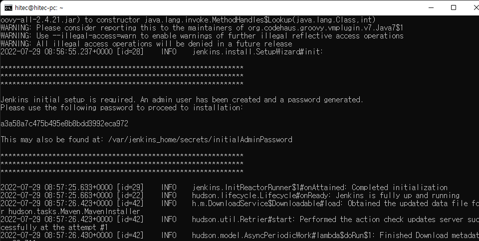
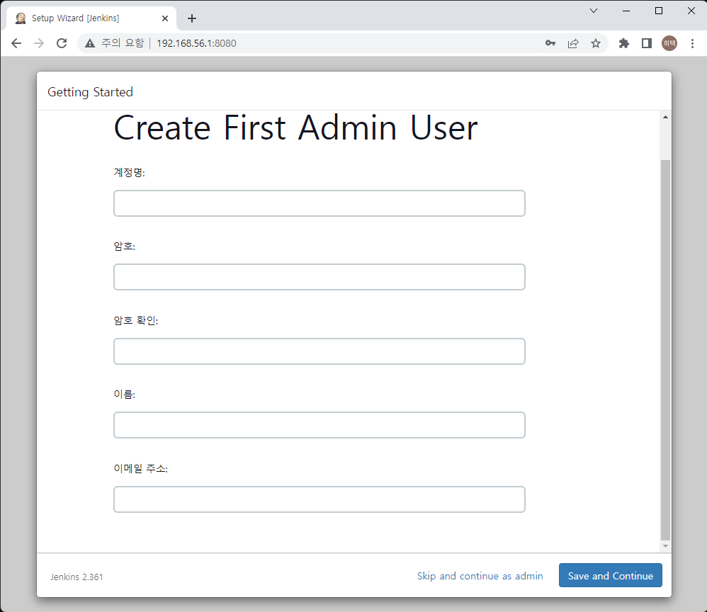
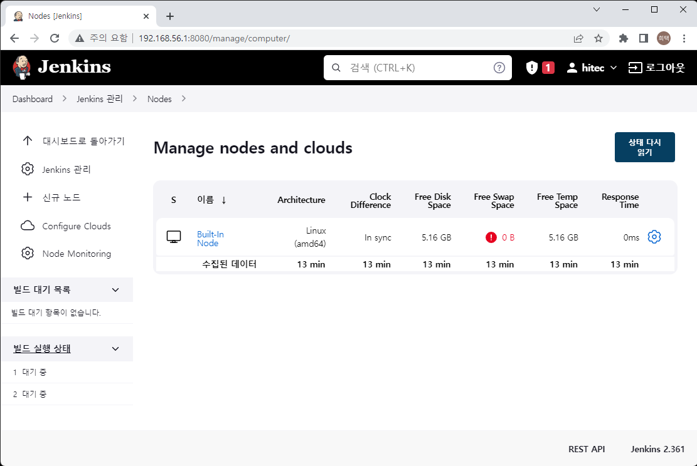
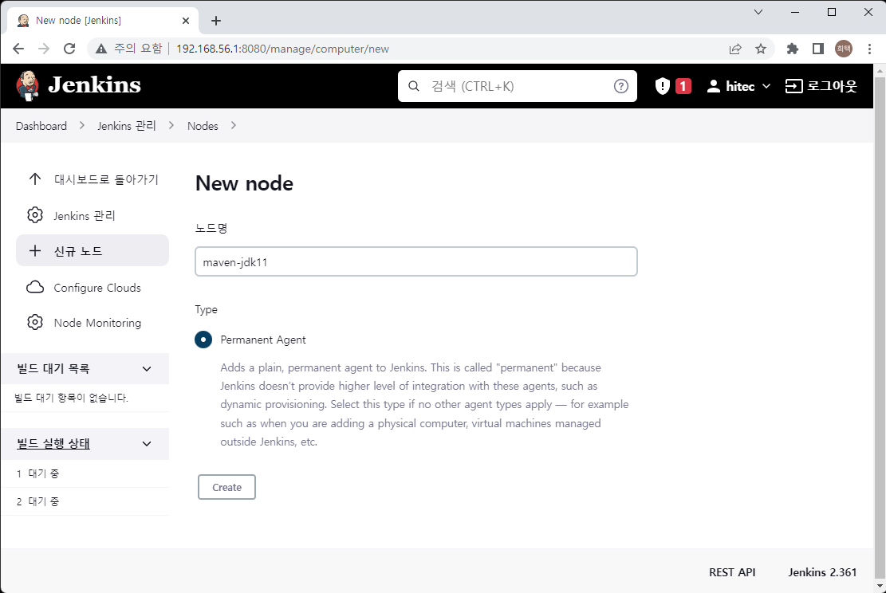
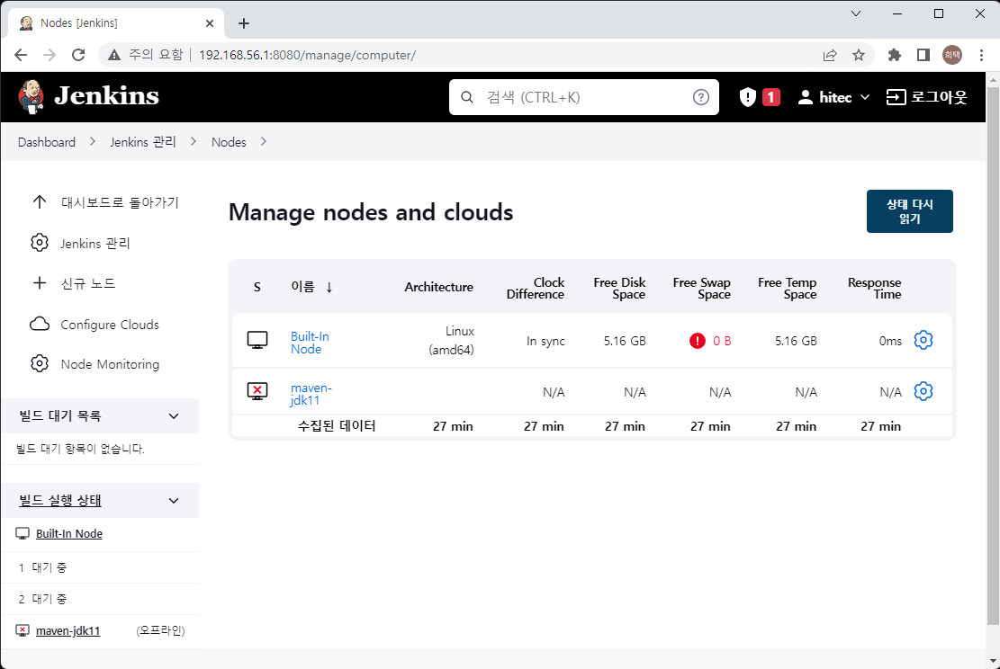
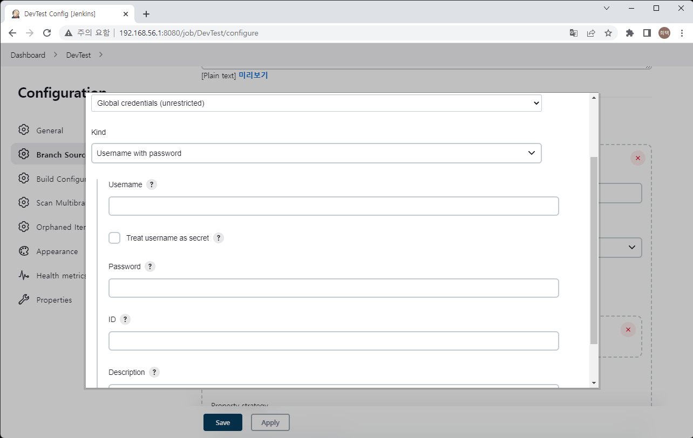
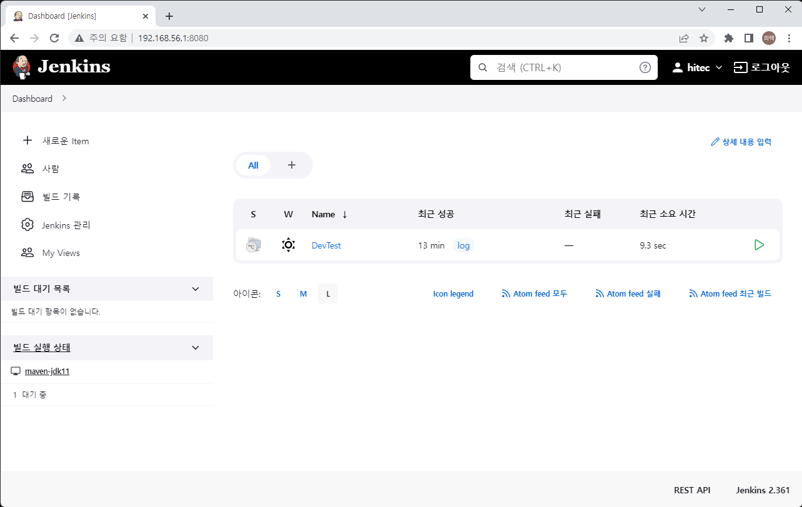

# Jenkins를 활용한 CI/CD

## 1. Jenkins 설치 (Docker)

1. Jenkins Docker 로 기동
    ```
    sudo docker run -d -p 8080:8080 -p 50000:50000 --restart=on-failure --name hitec-jenkins jenkins/jenkins:jdk11
    ```
    > -d 옵션 : daemon으로 실행   
    > -p 옵션 : port fowarding (앞 포트번호를 뒤 포트번호로 접근)   
    > --restart : 재기동 조건   
    > --name : 컨테이너의 이름

2. windows 에서 브라우저로 jenkins 열기
    > 윈도우즈에서 가상머신에서 기동중이 서비스에 접근하기 위해선   
    > virtualbox 의 포트 포워딩이 필요(우분투설치의 네트워크 설정 참조 포트는 8080)   

       

3. unlock jenkins
    > Administartor password 를 넣어 jenkins unlock   
    > Administrator password 설치 로그에서 확인 

    ```
    sudo docker logs hitec-jenkins
    ```

        

    > Please use the following password to proceed to installation 항목 확인   

4. suggested plugins 설치
        
    > jenkins를 잘 안다면 필요한 플러그인만 설치   
    > 제안하는 플러그인은 왠만하면 다 필요해 보임    

5. 어드민 계정 생성
        
    >계정명, 암호, 이름, 이메일주소를 입력하고 continue

6. 설치 완료
        

## 2. Jenkins 빌드 환경   
> jenkins 에서는 다양한 빌드 환경을 설정 할 수 있다.    
> 젠킨스 웹이 설치된 마스트 서버에서 바로 빌드할 수도 있고,   
> 빌드 환경이 구성된 서버를 에이전트를 설치해서 젠킨스로 관리할 수 있다.    
> docker 컨테이너를 클라우드 형태로 설정 할수도 있으며,   
> 쿠버네티스를 사용할 경우 빌드 환경을 파드로 설정해서 빌드 할 수도 있다.    

> 개발 환경이 다양하지 않을 것이고, 리소스를 많이 사용하지도 않을 것 같다.   
> 하지만 웹이 돌고있는 마스터에 빌드까지 돌리고 싶지는 않다.   
> 결론은 docker로 jenkins agent가 설치되어 있는 컨테이너를 구동하고,   
> 해당 컨테이너에서 빌드를 수행하도록 하려고 한다.   

1. Jenkins 설정
    1. 젠킨스 웹 화면에서 Jenkins 관리 > 노드관리 선택
        
    2. 좌측의 신규노드 선택   
        
    3. 노드 이름과 permanent agent 를 선택하고 생성   
    4. 설정 입력 후 저장   
        > number of executors : 한번에 빌드 할 수 있는 개수   
        > remote root directory : slave jenkins의 jenkins root /home/jenkins/agent 로 설정   
        > labels : slave가 여러대 일 경우 빌드 파이프라인에서 빌드 서버를 특정하기 위한 이름 maven-jdk11 로 설정   
    5. jenkins 관리 > 노드관리 메뉴에서 지금 생성한 노드에 X 표시되어 있음을 확인   
        
    6. 새로 생성된 노드 선택 후 jnlpUrl 항목과 secret 확인   
        
2. Jenkins Agent 기동   
    1. docker hub 에서 jenkins agent 검색   
        jenkins agent : [jenkins inbound-agent][jenkins-inbound-agent]     

        [jenkins-inbound-agent]: https://hub.docker.com/r/jenkins/inbound-agent "inbound agent"
        > maven 프로젝트이며 dockernizer 하고자는데   
        > 해당 agent에는 메이븐과 docker가 설치되어 있지 않음   
    2. maven, docker가 추가된 docker 이미지 생성   
        1. 적당한 위치에 디렉토리 생성 후 Dockerfile 생성   
            ```Dockerfile
            FROM jenkins/inbound-agent:jdk11

            USER root

            RUN apt update -y
            RUN apt install -y ca-certificates curl gnupg lsb-release
            RUN mkdir -p /etc/apt/keyrings
            RUN curl -fsSL https://download.docker.com/linux/debian/gpg | gpg --dearmor -o /etc/apt/keyrings/docker.gpg
            RUN curl -sL https://deb.nodesource.com/setup_16.x | bash -
            RUN echo "deb [arch=$(dpkg --print-architecture) signed-by=/etc/apt/keyrings/docker.gpg] https://download.docker.com/linux/debian $(lsb_release -cs) stable" | tee /etc/apt/sources.list.d/docker.list > /dev/null
            RUN apt update -y
            RUN apt upgrade -y
            # Install maven
            RUN apt install -qy maven
            # install docker
            RUN apt install -qy docker-ce-cli
            # intsll nodejs npm
            RUN apt install -qy nodejs

            #LocalPC의 Docker 로 연결 /var/run/docker.sock 해서 사용
            #LocalPC의 Docker Group ID 로 그룹 생성   
            RUN groupadd -g 999 docker
            RUN usermod -a -G docker jenkins

            USER jenkins
            ```
        2. docker 이미지 생성   
   
            ```sh
            sudo docker build -t <image name>:<version> .
            ex) sudo docker build -t hitec-jenkins-agent:0.0.1 .
            ```
        3. agent 기동
            > virtualbox 를 사용하고 있다면 장치>네트워크>네트워크 설정 의 고급탭의 포트포워딩 확인    
            > 8080, 50000 이 설정되어 있어야 함   

            ```sh
            sudo docker run --init -d --name <container name> -v /var/run/docker.sock:/var/run/docker.sock <빌드한 jenkins agent  image name> -url http://<localpc ip>:8080 <secret> <agent name>

            ex) sudo docker run --init -d --name hitec-jenkins-agent -v /var/run/docker.sock:/var/run/docker.sock hitec-jenkins-agent:0.0.1 -url http://192.168.56.1:8080 79545126d8b99e0835deac627b7a56a54f5248942a32fc58f37f141c19ac401e maven-jdk11
            ```
    3. master에서 빌드하지 못하도록 설정   
        1. master는 웹 UI 만 제공하며 빌드를 수행하지 못하도록 수정   
            1. Jenkins관리 > 노드관리 > Built-in Node 항목의 가장 오른쪽 설정아이콘   
                
            1. Number of executions 항목을 0으로 설정   

## 3. Jenkins 빌드 및 배포 (파이프라인)    
1. jenkins job 생성   
    1. 대쉬보드 좌측 메뉴 "새로운 Item 선택"   
    2. item name 설정 및 multi branch pipeline 선택
            
    3. Branch Source 항목 설정   
        1. add Source > Git 선택    
                 
        2. git repository url 입력    
        3. Credential 선택    
            1. credential 이 없을 경우 ADD 버튼 클릭   
                    
            2. username, password 에 git 서버의 계정정보 입력   
            3. ID 와 Description 에는 내가 보기 편한 이름 입력   
            4. 생성 후 리스트에서 선택   

2. 파이프라인 작성   
   
    1. "Jenkinsfile" 파일 생성 (프로젝트 소스의 루트 디렉토리에 생성)   

        ```Jenkinsfile
        pipeline {
            agent any
            stages {
                stage('BUILD') {
                    steps {
                        sh 'mvn package -DskipTests'
                    }
                }
                stage('STOP App') {
                    steps {
                        script {
                            try {
                                sh 'docker stop devtest'
                                sh 'docker rm devtest' 
                            } catch (err) {
                                echo err.getMessage()
                                echo 'Stop App Failed'
                            }
                        }
                    }
                }
                stage('Dockernizer') {
                    steps {
                        sh 'docker build --build-arg APP_FILE=target/testdemo*.jar -t devtest:0.0.1 .'
                    }
                }
                stage('Deployment') {
                    steps {
                        sh 'docker run -p 8081:8080 --name devtest devtest:0.0.1'
                    }
                }
            }
        }
        ```

3. 빌드 및 배포 테스트
    1. Jenkins Dashboard 에서 새로 생성한 Job 선택      
            
    2. 좌측의 Scan multibranch pipeline now 선택   
    3. 실행 하고 있는 브랜치 이름 선택   
            
    4. 빌드 배포 과정 확인   
    5. local pc에서 확인
        ```
        http://<local ip>:<port num>
        ex) http://192.168.56.1:8081
        ```

        > Deployment 단계에서 port fowarding 한 포트로 확인   
        > virtualbox 의 네트워크 설정에서 port fowarding 확인   

