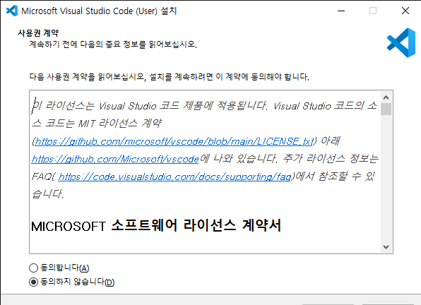
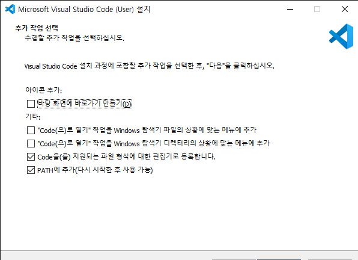
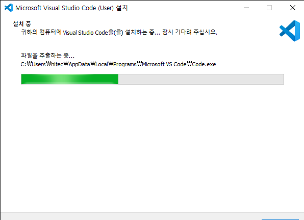
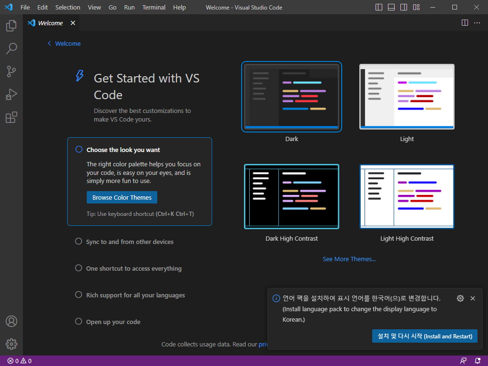
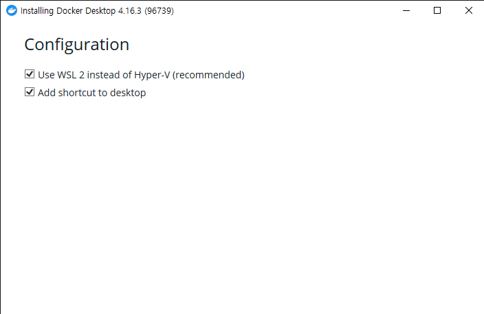
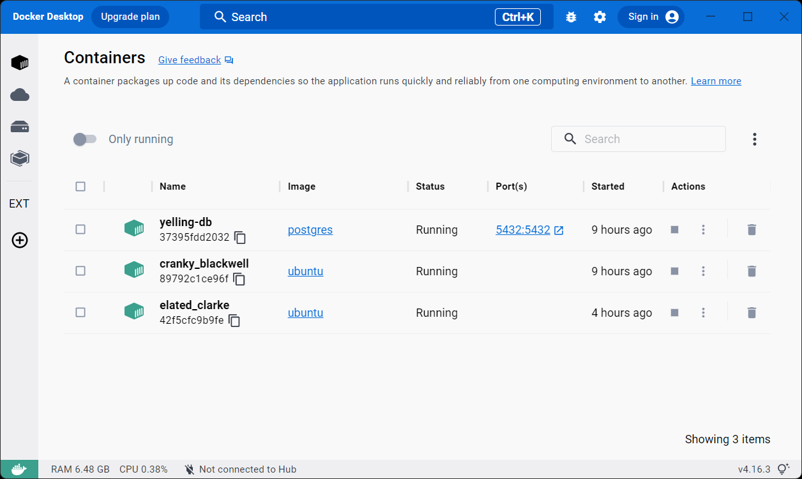
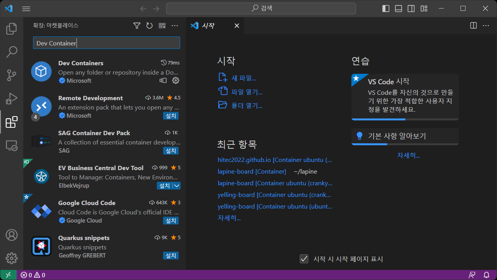
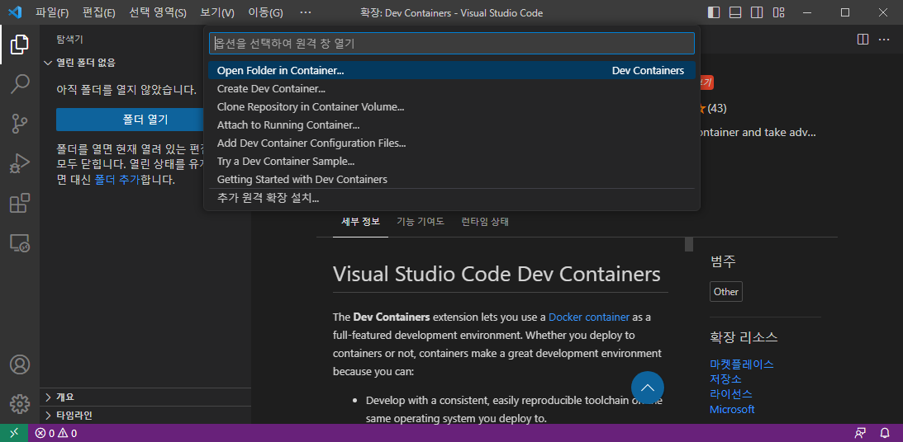
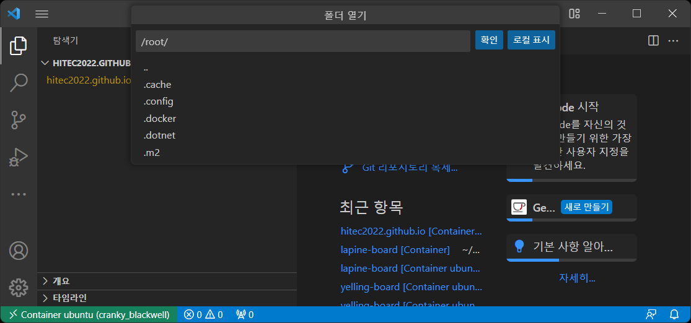
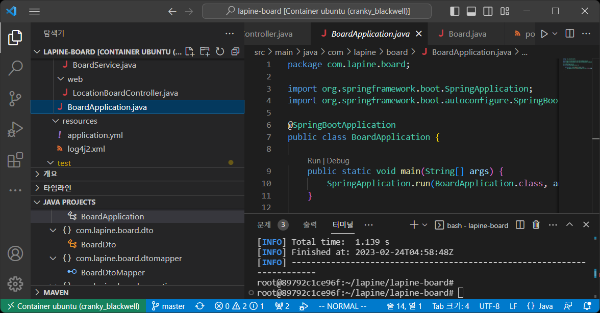

# VSCODE #
개발을 위한 툴 중의 하나이다.    
eclipse, intellij, sublime text 등등의 툴들이 있지만    
가장 많이 쓰이는 툴 중의 하나이다.    

## vscode 설치 ##
1. vscode 다운로드 (출처 : [vscode][vscode site]  )   

[vscode site]: https://code.visualstudio.com/ "VSCODE SITE"   

2. 다운로드 받은 파일 실행 후 약관동의

       

3. 설치위치, 시작메뉴 폴더 설정 후 추가작업 선택 

       
    > 다음 버튼을 통해서 진행   
    > 추가작업 선택은 모두 선택하는 것이 활용하기 편함   

4. 설치   

       

       
    > theme를 선택하고 설정을 마침   


## Docker Install on Windows ##
1. docker 다운로드 (출처 : [docker][docker site]  )   

[docker site]: https://www.docker.com/https://code.visualstudio.com/ "Docker SITE"   

2. 설치   
       
    > WSL2 는 윈도우즈에서 리눅스를 띄우기에 편리하다.    
    > WSL2  설치가 우선 진행이 된다.    
    > WSL2는 사용하지 않아도 된다. (hyper-v 를 통해 기동하게된다.)    

3. 설치완료   
       
    > 윈도우즈에서 DOcker 설치한 모습이며 개인적으로 사용하는 컨테이너가 3개 보인다.    

## Local 개발환경 with Docker Container ##  
로컬 개발환경을 설정하다보면 개발에 필요한 다양한 툴들을 설치하게 된다.    
git, maven, java, gradle, npm, yarn, node, python, php 등등 의 다양한 툴들과   
툴 별 다양한 버전들을 가지게 되어 여러 프로젝트를 수행하기에 로컬에 툴들을 설치하기가 꺼려지게 된다.    
컨테이너를 활용하여 필요한 툴과 특정 툴의 버전만을 가지는 환경을 구성함으로써   
로컬 개발 환경을 깨끗하게 보전할 수 있다.    
또한 같은 환경의 프로젝트에서 컨테이너 이미지를 공유함으로써 보다 손쉽게 개발 환경을 공유할 수 있다.     

1. vscode 에 Dev Containers extension 설치   
    * 좌측의 확장 탭을 선택 후 "Dev Container" 로 검색 후 설치   
       

    > Dev Containers를 설치하면 좌측 아래쪽에 녹색 버튼이 활성화가 된다.    
    
       
    > 컨테이너를 활용한 다양한 기능이 있다.    
    > 툴 기능을 통해 새로 생성할 수도 있지만, 외부 컨테이너에서 실행 후 연결하는 방식을 사용하고자 한다.    

2. 컨테이너를 실행하고 필요한 툴을 설치   
    * windows 에서 cmd 혹은 powershell 을 실행   

    1. 자신이 원하는 OS 를 컨테이너로 실행한다. 
        ```
        docker run --name vscodedev -it -d --privileged -v C\Users\hitec\sample:/root/sample ubuntu
        ```
        > 개인적으로 익숙한 ubuntu 를 선택하였습니다.    
        > 윈도우즈의 폴더와 컨테이너의 우분투 사이에 볼륨을 세팅함으로 컨테이너가 오류가 발생하여도 로컬서버에 소스가 남길 수 있도록 하였습니다.    
        > 컨테이너 내부에서 다시 Docker container 명령어를 사용할 경우를 대비하여 privileged 옵션을 주었습니다.    
    2. 컨테이너 내부에서 필요한 툴 설치   
        1. 컨테이너 접근   
            ```
            docker exec -it vscodedev /bin/bash
            ```
        2. 필요한 툴 설치 (필요에 따라 개발 환경에 따라)
            ```
            apt update
            apt install git
            apt install openjdk-17-jdk
            apt install maven
            ```
        3. 컨테이너 내부에 Docker 설치(필요한 경우)
            ```
            apt update
            apt install ca-certificates curl gnupg lsb-release
            mkdir -m 0755 -p /etc/apt/keyrings
            curl -fsSL https://download.docker.com/linux/ubuntu/gpg | gpg --dearmor -o /etc/apt/keyrings/docker.gpg
            echo "deb [arch=$(dpkg --print-architecture) signed-by=/etc/apt/keyrings/docker.gpg] https://download.docker.com/linux/ubuntu $(lsb_release -cs) stable" | tee /etc/apt/sources.list.d/docker.list > /dev/null
            apt install docker-ce docker-ce-cli containerd.io
            ```
            * 컨테이너 기동 시 Docker 가 자동이로 기동되는 방법은 못찾았음   
            * systemctl 명령어는 사용할 수 없으며 service 명령어로 docker 기동   
            * service docker start

        4. 소스 받기   
            * 개발 소스를 내려받는다.    
            ```
            git clone https://myprojectrepository/myproject.git
            ```

3. vscode 에서 컨테이너로 연결   
    * Dev Containers extension 이 설치가 되면 좌측 메뉴에 원격탐색기 메뉴가 보이게된다.    
       

    * docker 명령어로 실행한 컨테이너 목록이 메뉴에 나오는 것을 확인 할 수 있다.    
    * 컨테이너 항목에서 우측 X 표시옆에 'Attach to Container' 버튼을 선택한다.    
    * 새로 vscode 창이 뜨며 폴더열기 화면이 표시된다. 
       
    * 내려받은 소스 위치를 선택하고 확인   


4. vscode 활용   
    * 소스가 vscode 에 보여지게 되고 개발을 진행 할 수 있다.    
       
    > 하단의 터미널을 오픈 할 경우 컨테이너의 터미널이 바로 열리게되어   
    > 설치 진행하였던 git maven gradle 등의 명령어를 바로 사용할 수 있다.     

    > extension을 더 추가할 경우 extension 은 컨테이너 내부에 설치가 되며,   
    > vscode 가 extension으로 지저분해지는 것을 방지할 수 있다. 

