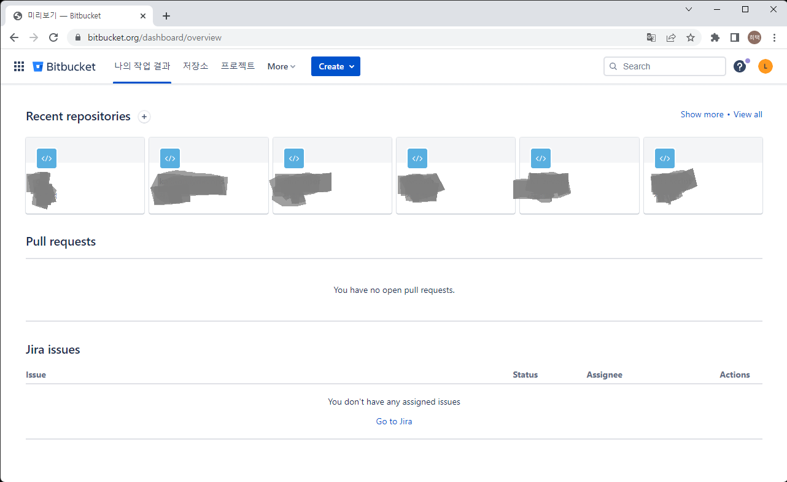
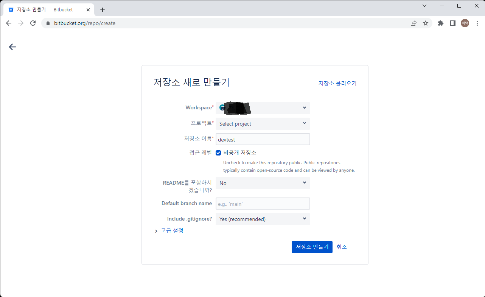
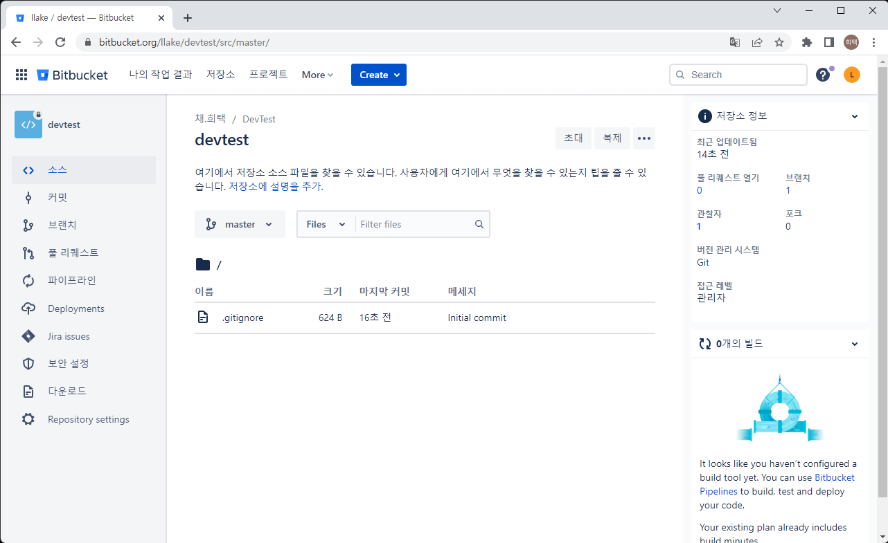
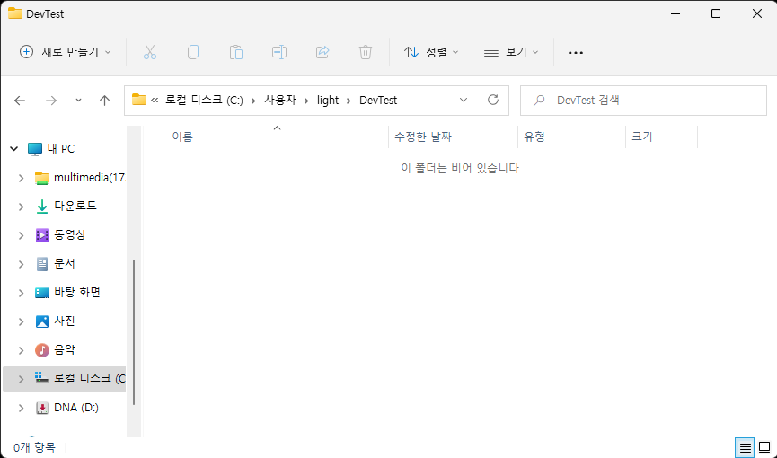
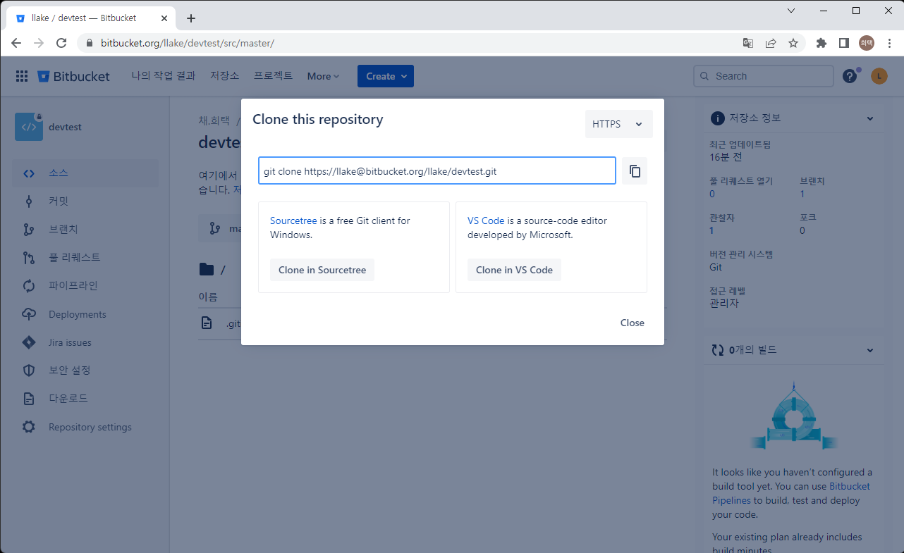
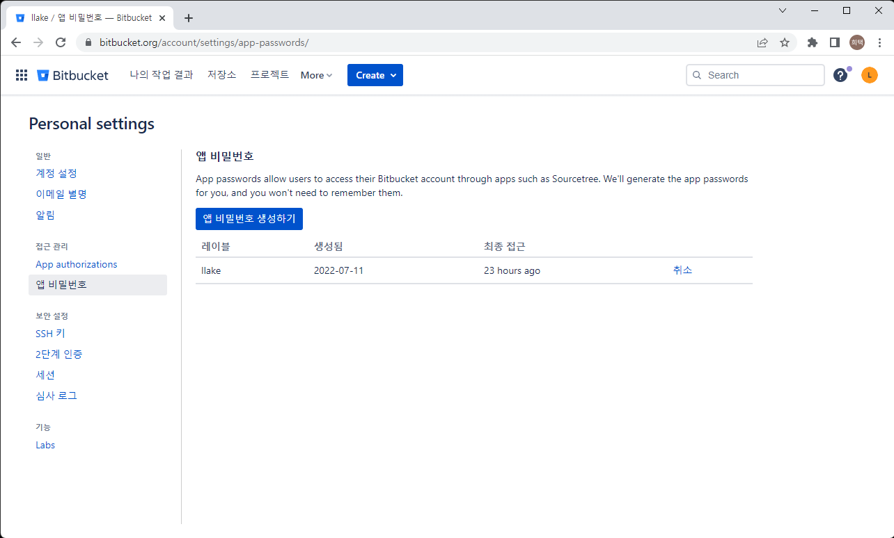

# 소스 형상 관리
> 소스 형상 관리는 개발 소스코드를 저장하고 필요한 곳에서 다운받아 쓸 수 있는 저장소이다.    
> 보통 하나의 소스코드에 여러명이 개발을 하기때문에 여러명이 개발 하기 위한 기능들이 있다.    
> 개발은 점진적으로 추가 변경되기 때문에 언제 어떤게 개발되었는지 내역을 관리한다.   

> 여러가지 소스형상관리 툴들이 존재한다. cvs, svn, git, mecurial 등등   
> 지금은 거의 git 을 쓴다.   
> git repository를 제공하는 방법도 다양하다.    
> git 만 서버에 설치하거나,    
> git을 사용하기 편하게 UI로 제공하고, 개발에 필요한 다양한 기능들을 제공해주는 git 툴을 설치하거나,   
> 사이트에 접근해서 로그인 후 바로 쓸수 있는 저장소를 쓸 수도 있다.    
> github, gitlab, bitbucket 등이 유명하다.    
> 이 중 jira와 confluence를 쓸 수 있는 bitbucket을 써보자

1. bitbucket 접근
   1. https://bitbucket.org/product/ 
   2. 회원가입 및 로그인
      
   > 프로젝트를 몇개 쓰고있어서 recent repositories 가 나옴
   > 처음 회원가입 후 로그인 하면 나오지 않음   
2. repository 생성
   1. 가운데 "Create" 버튼에서 "저장소" 를 선택   
      
   2. Workspace 선택
      > 현재는 본인 계정이름의 하나만 있지만 다른 사람과 같이 작업하거나 따로 관리하고자 할 경우 추가로 더 만들 수 있음    
   3. 프로젝트 이름 설정   
      > 생성된 프로젝트가 있고 그 프로젝트에 추가할 repository 면 선택   
      > 프로젝트가 없을 경우 "새 프로젝트" 선택 후 프로젝트 명 입력   
   4. 저장소 이름 및 기본 설정   
      > 저장소 이름을 적절히 설정   
      > 접근레벨 : 비공개 저장소일 경우 나만 볼 수 있으며, 공개 할 경우 누구나 접근 할 수 있음   
      > README : 프로젝트에 대한 전반적인 내용을 작성하는 파일을 만들 것인지 여부   
      > Default branch name : 브렌치 전략이 있을 경우 master 브랜치가 아닌 다른 브랜치를 기본으로 쓸 지 여부   
      > .gitignore : 로컬PC 등 작업 환경에서 개발할 경우 저장소에 업로드가 필요없는 파일 목록 (개발 툴 관련 파일 등)   
   5. 저장소 만들기 
      
3. 원격 저장소에서 개발 PC 로 내려받기      
   > 원격에 있는 저장소를 local PC 에서 내려받고 local PC 에서 개발   
   > 다시 원격 저장소로 개발 사항을 업로드   
   1. 로컬 PC의 적당한 위치에 폴더 생성   
      
   2. 생성한 폴더에서 터미널 실행    
   3. bitbucket repository 화면에서 URL 복사   
      1. 오른쪽 위에 "복제" 버튼을 선택   
         
      2. 화면에 나온 URL을 복사   
   4. 터미널 화면에 붙여넣기 후 실행   
      > 윈도우즈에 git client 가 설치되어 있어야 함   [Git 다운로드](https://git-scm.com/)   
      ```
      git clone <repository url>
      ```
   5. repository 이름의 새로운 디렉토리가 생성되었음   
   6. 디렉토리 내부에 개발 소스 저장   
   7. 개발 완료 된 내역 원격에 업로드   
      ```
      git add .
      git commit -m "적절한 코멘트"
      git push
      ```
   8. git clone을 이미 한 디렉토리 인 경우 최신 소스 가져오기   
      ```
      git pull
      ```

> git은 여러명이 개발하기에 좋은 기능들을 많이 가지고 있음   
> 여기에서는 단순히 혼자서 개발 할 경우의 내용이며  
> 추후에 git 사용법에 대한 자세한 내용을 공유 할 수 있으면 좋겠다   

# bitbucket 에서 access key 생성   
   1. bitbucket 우측 상단의 프로필 아이콘 클릭 > Personal Settings 선택 > 앱 비밀번호 선택   
         
   2. 라벨이름 설정 및 권한 설정   
         
   3. 생성 버튼 클릭 후 Access Key 생성 확인
      > 팝업 닫으면 다시 볼 수 없음 주의    