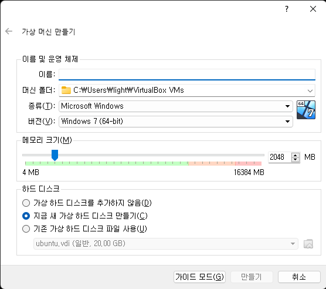
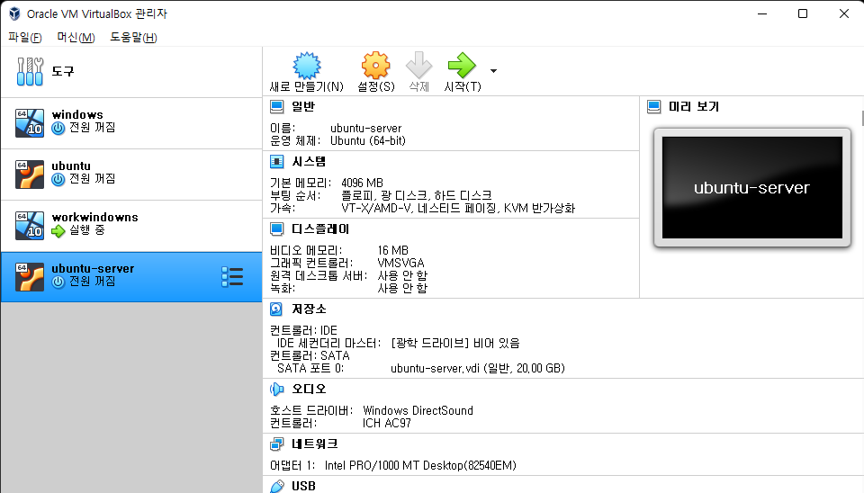
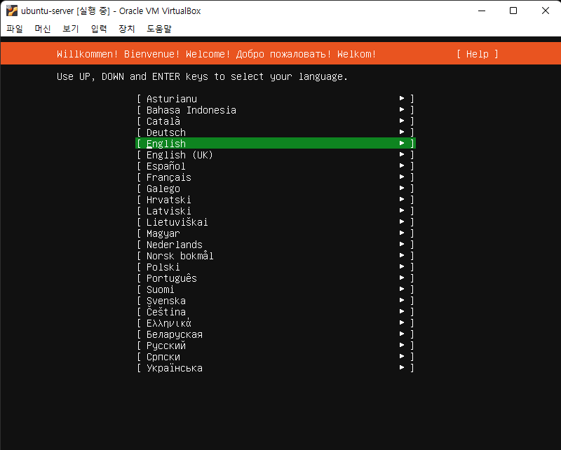
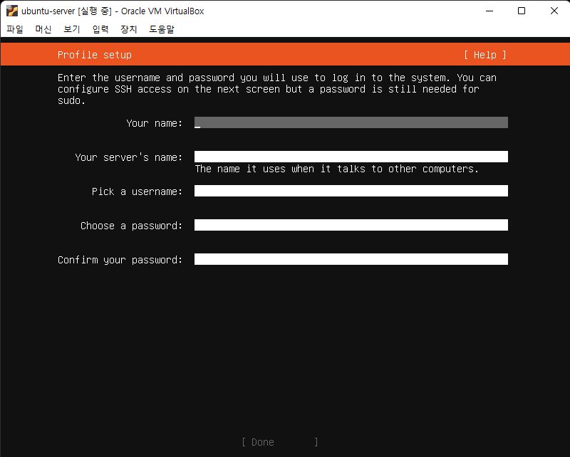
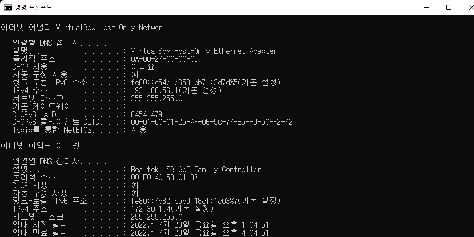
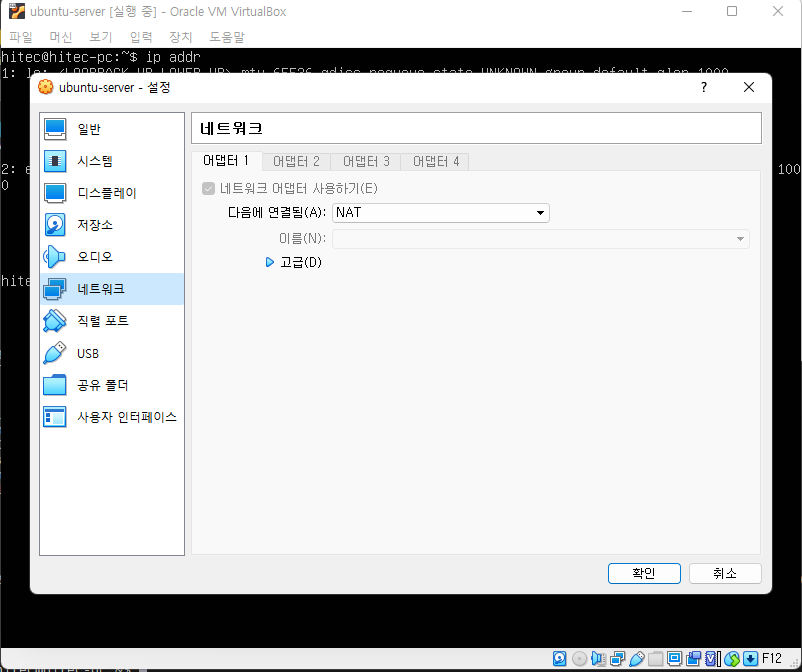
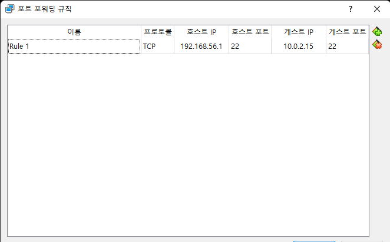

# 우분투 설치
> 리눅스 운영체제 중 익숙한 우분투를 선택   
> 서버 타입으로 선택 (데스크탑으로 쓸 건 아니라서...)

## 1. 우분투 서버 타입 다운로드
1. 우분투 이미지 다운로드 (https://ubuntu.com/download/server)
    > 다운로드 Option이 3개가 있다. multipass 라는게 새로 나온 듯..   
    > 익숙한 Manual server installation 을 선택
2. 다운로드 버튼을 눌러 Ubuntu Server ISO 이미지를 다운로드


## 2. 우분투 설치 

### 2.1 가상 머신 만들기
1. virtualBox 에서 가운데 위에 있는 "새로 만들기" 버튼을 선택
    
2. 이름을 적당히 지어줌(ex ubuntu-server)
3. 종류는 리눅스, 버전은 ubuntu (64-bit) 선택
4. 메모리는 본인 PC 의 사양을 봐서 적당히 선택 (최소 2기가 이상이면 좋은 듯)
5. 하드 디스크는 "지금 새 가상 하드 디스크 만들기" 선택
    
6. 디스크는 크기 설정 (20기가 정도면 넉넉한 듯)
   > 하드디스크 파일 종류 등 다른 옵션을 선택해도 되지만 잘 모를 땐 추천하는 걸로 선택
7. 만들어진 가상 이미지 확인
    
    > 좌측의 ubuntu-server 목록   
    > 생성된 이미지는 OS가 설치되어 있지 않은 컴퓨터와 같음    
    > 여기에 우분투 OS를 설치를 해야 함

### 2.2 서버형 우분투 설치
1. 새로 만들어진 좌측의 가상 이미지를 더블 클릭
     
2. 우측의 브라우저 모양 아이콘을 클릭하여 "광학 디스크 선택기"를 선택
3. "광학 디스크 선택기"의 "추가" 버튼을 통해서 다운받은 리눅스 이미지를 선택
4. 다운받은 리눅스 이미지를 선택했으면 시작 버튼을 통해 설치 시작
      
5. Try or Install Ubuntu Server 선택
      
6. English 선택
      
7. "Continue without updating" 선택
   > 업데이트를 하면서 설치해도 상관없음   
   > 설치가 완료되면 최신으로 업데이트 할 예정임   
8. 이어서 나오는 항목에 대해 Done 선택
9. profile 설정 화면에서 프로필 설정
      
    > username, password 가 서버에 접근하는 계정이 됨
10. SSH Setup 화면에서 Install OpenSSH server 선택 
11. Featured Server Snaps 화면은 그냥 넘어가기로 함
    > 필요한 서비스를 선택해서 설치할 수 있음   
    > 설치 완료후 수동으로 설치하기로 함
12. 우분투 설치 중
      
13. 설치 완료 reboot
      
14. 리부팅 후 Profile 에서 설정한 username, password로 로그인
      


> 설치 진행 화면을 클릭하면 화면안에서 커서를 통해 이동할 수 있음   
> 선택은 체크박스 모양은 스페이스 바로 선택은 엔터키로 설정

## 3. 윈도우즈에서 우분투에 터미널로 접근 
> 가상이미지에서 여러 작업을 수행하기에는 터미널이 1개여서 어려움이 많다   
> 윈도우즈에서 터미널 툴을 통해 서버에 접근할 필요가 있다. 

1. ubuntu ip 확인
    ```sh
    ip addr
    ```
      
     > IP 가 10.0.2.15 번인 것을 확인 할 수 있다. 
2. windows(local pc) ip 확인
      
    > 설명에 virtualBox Host-Only Ethernet Adapter 로 되어 있는 항목을 찾음   
    > 예시에서는 192.168.56.1 
3. windows(local pc)에서 10.0.2.15번으로 접근이 되지 않는다. 
4. virtualbox 에서 네트워크를 열어줘야한다. 
   > virtualbox를 설치하면 가상머신 자체의 네트워크가 생성된다.   
   > 윈도우즈에서 가상머신의 네트워크를 통해 특정 머신으로 연결될 수 있도록 설정이 필요하다.
    1. 우분투 가상머신의 탑 메뉴 중 "장치>네트워크>네트워크설정"을 선택
    2. 좌측 "네트워크"를 선택
      
    3. 가운데 "고급" 버튼을 눌러서 고급 설정 메뉴를 열고 "포트 포워딩"을 선택
      
    4. 우측의 "+" 버튼을 눌러 Rule을 추가하고 설정
        > 호스트IP 는 windows 에서 찾은 IP를 적음   
        > 게스트IP 는 ubuntu 의 IP를 적음    
        > 호스트포트, 게스트포트는 연결하려는 서비스의 포트 (여기서는 ssh를 열기위해 22)
5. windows 에서 터미널 툴을 열고 ssh 접근
    ```sh
    ssh <username>@<호스트IP>
    ```
      

## 4. 우분투에 docker 설치  

> 개발을 진행하다보면 여러가지 툴들을 설치하게 된다.   
> 각각의 툴들은 개발 언어가 다양하고 버전이 다양하고 동작하는 환경이 다양하다.   
> 개발을 위해 하나밖에 없는 머신에 이것저것 깔리면 충돌이 나거나 제대로 동작을 하지 않을 수 있다.   
> os 자원을 공유하며 서로 분리된 서버형태를 취할 수 있는 컨테이너를 사용하자.   
> 추후에 쿠버네스트 등을 통해 운영할 때를 대비해서 컨테이너화 하는것도 좋다.   

1. 최신 업그레이드
    ```sh
    sudo apt update
    sudo apt upgrade
    ```
2. docker 설치
    1. 필요 소프트웨어 설치
    ```
    sudo apt-get install ca-certificates curl gnupg lsb-release
    ```

    2. GPG 키 추가 
    ```
    sudo mkdir -p /etc/apt/keyrings
    curl -fsSL https://download.docker.com/linux/ubuntu/gpg | sudo gpg --dearmor -o /etc/apt/keyrings/docker.gpg
    ```

    3. repository 추가
    ```
    echo \
        "deb [arch=$(dpkg --print-architecture) signed-by=/etc/apt/keyrings/docker.gpg] https://download.docker.com/linux/ubuntu \
        $(lsb_release -cs) stable" | sudo tee /etc/apt/sources.list.d/docker.list > /dev/null
    ```

    4. Docker 설치
    ```
    sudo apt-get update
    sudo apt-get install docker-ce docker-ce-cli containerd.io docker-compose-plugin
    ```

    5. Docker 설치 확인 
    ```
    sudo docker run hello-world
    ```
      


    docker 설치 방법 출처 : [docker docs][installdockerlink]     

    [installdockerlink]: https://docs.docker.com/engine/install/ubuntu/ "install on Ubuntu"


