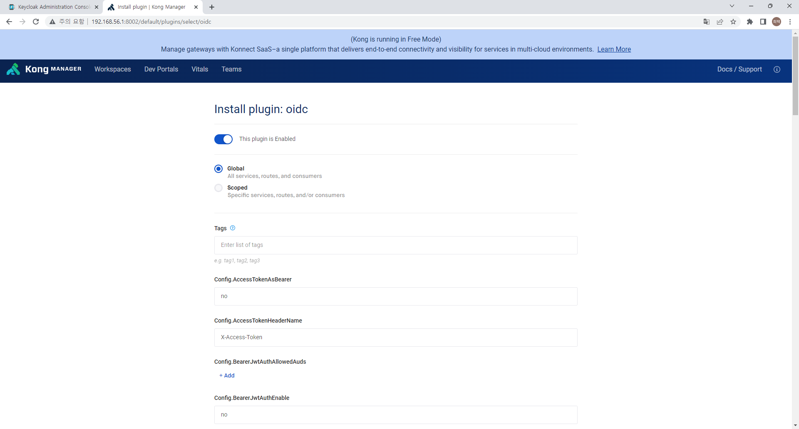

# Kong 과 Keycloak 연동 (OIDC)       

> Kong에 Keycloak을 연동 함으로써 Client 에서 Keycloak으로 부터 발급받은 키를 kong에서 validation 체크를 할 수 있다.    

1. Kong-oidc plugin 설치   
    kong enterprise 버전에는 oidc 에대한 플러그인이 기본으로 제공이된다.    
    하지만 무료버전에서는 제공하지 않는다.   
    하지만 어떤 훌륭하신 분들 (https://github.com/nokia/kong-oidc) 이 관련 플러그인을 개발해 주셨다.    
    해당 플로그인을 설치하고 설정해보자   
    
    1. kong이 설치되어 있는 컨테이너에 접속     
        ```sh
        sudo docker exec --user root -it <container name> /bin/bash
        ```
        > root 유저로 접속   
    2. kong-oidc 설치   
        ```sh
        apt update
        apt install unzip
        luarocks install kong-oidc
        ```
        > 컨테이너 환경에 unzip 이 없어서 unzip을 설치 후 luarocks를 이용하여 kong-oidc 설치   
           
        > luarocks 로 바로 설치할 경우 최신 Kong에서는 설치가 되지 않는다.    
        > Kong 에서 BasePlugin 이라는 모듈이 deprecated 되다가 삭제가 된 듯 하다.    
        > 다행이도 nokia/kong-oidc 를 fork 하여 3.x 버전에 맞게 수정 개발 한 버전이 있다.참으로 훌륭하신 분이다. (https://github.com/revomatico/kong-oidc.git)    
        > 그런 경우 아래와 같이 설치 해보자    

        ```sh
        apt update
        apt install git unzip vim build-essential libreadline-dev
        git clone https://github.com/revomatico/kong-oidc.git
        cd kong-oidc
        mv ./kong-oidc.rockspec ./kong-oidc-1.3.0-1.rockspec
        luarocks make
        ```

    3. kong-oidc 설정   
        ```sh
        cd /etc/kong
        cp ./kong.conf.default ./kong.conf
        ```
        > Kong 설정파일을 디폴트 파일에서 복사한다.    

        ```
        plugins=bundled, oidc
        ```
        > kong.conf 파일의 위 항목을 찾아서 수정한다.    
    
    4. KongManager 설정화면      
        1. KongManager 의 Plugins 항목의 Install Plugin 에서 OIDC를 찾으면 없다   
        2. KongManager에서 막았는지 어쨌는지....URL을 바로 치고 들어가면 설정화면이 나온다.     
            ```
            http://192.168.56.1:8002/default/plugins/select/oidc
            ```

2. keycloak 에서 새로운 client 생성   
    키클락에 frontend 에 적용된 client가 존재한다.   
    하지만 spa 에 적용하기 위해 client authentication(confidential access type) 이 적용되지 않아 client-secret이 없다.     
    앞서 적용한 kong-oidc 플러그인은 client secret 이 적용되어야 한다.    
    
    이런 경우 같은 realm 에서 client를 새로 생성하고 confidential access type으로 설정한다.    
    같은 realm 의 client 임으로 SSO 가 적용이 되며 frontend에서 생성한 키로 validation check 가 된다.    

    1. client 생성   
        client 생성 시 client authentication 을 ON으로 변경한다.    
            

    2. client-secret 확인   
        client 상세화면에서 Credentials 탭 확인    
        하단의 client secret 확인   
            


3. KongManager 에서 kong-oidc 설정   
     
    1. KongManager plugin 설정화면    
        KongManager 에서 oidc 플로그인 내역이 나오지 않을 경우 아래와 같이 바로 URL 입력   
        http://192.168.56.1:8002/default/plugins/select/oidc  
            

    2. scope 설정    
        plugin 이 어디 범위까지 적용할지 설정한다.    
        설정은 service, route, consumer 단위로 설정할 수 있다.    
        생성 수정 삭제 URL 만 따로 빼서 ROUTE를 만들고 해당 route 를 범위로 설정한다.    

    3. Kong에 Keycloak 연동 설정        
        config.client_id ex) kongclient   
        > confidential access type으로 생성한 Client 의 ID   
        
        config.client-secret ex) 2uCcRdlWW13pqOwc1253KS2D0AIBzGtcp   
        > confidential access type으로 생성한 Client 의 client secret

        config.bearer_only ex) yes   
        > yes 인 경우 토큰을 검사하기만 한다. no 인 경우 로그인 절차를 따른다. 

        config.realm ex) hitec  
        > front end 에서 사용한 realm 과 같은 realm이어야 로그인이 가능하다.     

        config.introspection_endpoint ex) http://192.168.56.1:8090/realms/hitec/protocol/openid-connect/token/introspect   
        > access token 에 대한 정보를 조회 하는 URL (verify 하기 위한 정보)   
        
        config.discovery ex) http://192.168.56.1:8090/auth/realms/hitec/.well-known/openid-configuration
        > realm 에 대한 정보들을 모아놓은 URL      
