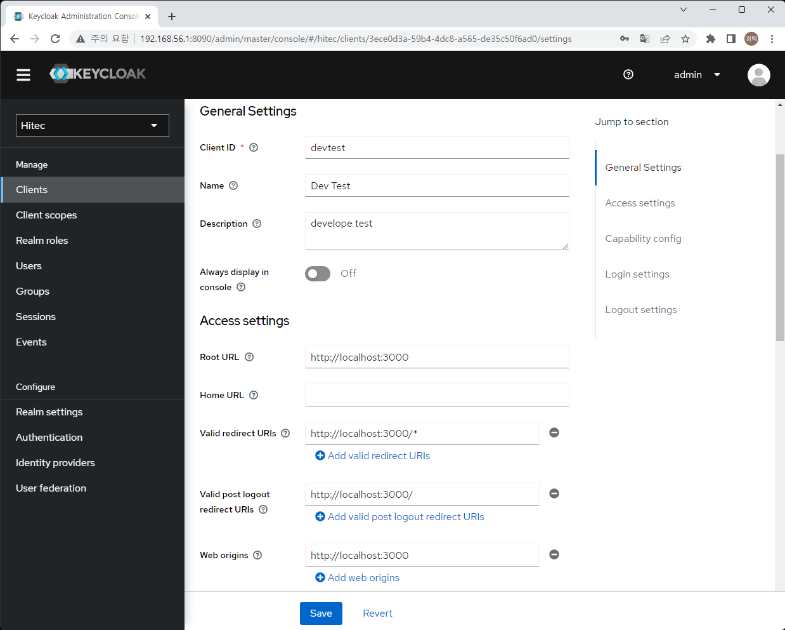
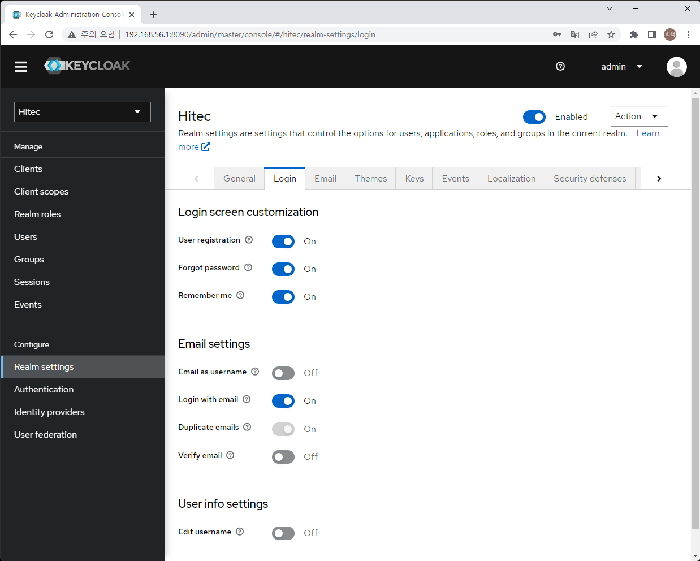

# React JS 에 Keycloak 연동   
    앞에 만든 board 화면에 사용자 회원가입, 로그인 을 추가한다.   
    board 화면에서 회원가입을 받고 로그인을 하면 토큰을 받는다.   
    board 화면(frontend)에서 토큰을 받아 서버 (backend)에 요청 할 때 토큰의 valid 여부를 체크한다.    
    서버 호츨은 Kong(Api Gateway) 를 통해 호출 할 예정이므로 valid 체크는 kong에서 하도록 한다.    
    여기서는 frontend 와 keycloak의 연동을 해보도록 하자     

1. keycloak 설정   
    1. client 설정   
    대부분의 설정은 Default 설정을 그대로 사용한다.   
    필요에 따라서 수정하면 된다. 여기는 기본적인 세팅을 우선 다루고자 한다.   
      
    > 로컬 환경에서 npm으로 개발 할 경우 3000번 포트를 사용한다. 운영에서 변경 필요   
    > Root URL, Valid redirectUrls, valid logout, web origins 등에 localhost:3000 을 추가한다.    

    2. RealM 설정   
    사용 용도에 따라 로그인 및 회원가입 등의 방법을 선택할 수 있다.    
      
    > user registration : 회원가입   
    > forgot password : 비밀번호 찾기  
    > Remember me : 브라우저 재시작 시 로그인 유지 여부   

    3. oid 방식도 클라이언트에 맞게 세팅할 수 있다. 
    4. 로그인 페이지를 키클락에서 제공을 한다. 그래서 로그인 화면을 수정할 수 있다. 
    5. 다른 SNS 로그인을 지원한다.  


2. front end 에 keycloak 적용   
    1. keycloak 라이브러리 설치  
        ```sh
        npm install keycloak-js @react-keycloak/web
        ```
        > keycloak-js -> 공식 키클락 라이브러리   
        > @react-keycloak/web -> react 프로젝트에 키클락 라이브러리 적용 

    2. keycloak 설정 정보   
        키클락과 연결하기 위한 기본 설정   
        ```js
        import Keycloak from "keycloak-js";

        const keycloak = new Keycloak({
            realm: "hitec",
            url: "http://192.168.56.1:8090/",
            clientId: "devtest"
        });

        export default keycloak;
        ```
        > realm : keycloak 에서 생성한 RealM   
        > url : keycloak 의 URL   
        > clientId : RealM 에서 생성한 Cleint 의 아이디   
    
    3. PrivateRoute 만들기   
        로그인 여부에 따른 콤포넌트의 화면 출력   
        ```js
        import { useKeycloak } from "@react-keycloak/web";

        const PrivateRoute = ({ children }) => {
            const { keycloak } = useKeycloak();
            const isLoggedIn = keycloak.authenticated;
            return isLoggedIn ? children : null;
        };

        export default PrivateRoute
        ```

    4. Navi bar 만들기   
        화면 상단에 /로 갈수 있는 링크버튼을 추가하며, 로그인 로그아웃 버튼을 추가   
        ```js
        import React from 'react'
        import { useKeycloak } from '@react-keycloak/web';

        export const Navbar = () => {
        const { keycloak, initialized } = useKeycloak();

        return (
            <div>
            <div className="top-0 w-full flex flex-wrap">
            <section className="x-auto">
                <nav className="flex justify-between bg-gray-200 text-blue-800 w-screen">
                <div className="px-5 xl:px-12 py-6 flex w-full items-center">
                    <h1 className="text-3xl font-bold font-heading">
                    Keycloak React AUTH.
                    </h1>
                    <ul className="hidden md:flex px-4 mx-auto font-semibold font-heading space-x-12">
                    <li>
                        <a className="hover:text-blue-800" href="/">
                        Home
                        </a>
                    </li>
                    </ul>
                    <div className="hidden xl:flex items-center space-x-5">
                    <div className="hover:text-gray-200">
                        {!keycloak.authenticated && (
                        <button
                            type="button"
                            className="text-blue-800"
                            onClick={() => keycloak.login()}
                        >
                            Login
                        </button>
                        )}

                        {!!keycloak.authenticated && (
                        <button
                            type="button"
                            className="text-blue-800"
                            onClick={() => keycloak.logout()}
                        >
                            Logout ({keycloak.tokenParsed.preferred_username})
                        </button>
                        )}
                    </div>
                    </div>
                </div>
                </nav>
            </section>
            </div>
        </div>
        )
        }
        ```

    5. App.js 에 적용   
        App.js 에 키클락 연동   
        ```js
        import React from 'react';

        import { BrowserRouter, Routes, Route } from 'react-router-dom'
        import { ReactKeycloakProvider } from "@react-keycloak/web";

        import keycloak from './app/keycloak.js'
        import PrivateRoute from './app/PrivateRoute.js';
        import { Navbar } from './app/Navbar.js';

        import { AddBoardForm } from './features/board/AddBoardForm.js'
        import { EditBoardForm } from './features/board/EditBoardForm'
        import { BoardList } from './features/board/BoardList'
        import { BoardPage } from './features/board/BoardPage'

        function App() {
        return (
            <div>
            <ReactKeycloakProvider authClient={keycloak}>
            <Navbar />
            <BrowserRouter>
                <div className="App">
                <Routes>
                    <Route exact path="/" element={<><BoardList />
                    <PrivateRoute>
                        <AddBoardForm />
                    </PrivateRoute>
                    </>} />
                    <Route exact path="/board/:id" element={<BoardPage/>} />
                    <Route exact path="/editboard/:id" element={<EditBoardForm/>} />
                    <Route exact path="/board" element={<AddBoardForm/>} />
                </Routes>
                </div>
            </BrowserRouter>
            </ReactKeycloakProvider>
            </div>
        );
        }

        export default App;
        ```
        > ReactKeycloakProvider 로 전체를 감싸서 키클락을 전체 적용   
        > PrivateRoute 를 통해서 로그인 되었을 때만 보이도록 수정   
    
    6. 서버 API 호출 시 토큰을 추가하여 호출  
        useKeycloak 을 통해 키클락의 토큰정보를 가져올 수 있음   
        api 호출 시 파라미터로 토큰 값을 넘겨주고 header 의 Authorization 값 세팅   

        ```js
        //addBoardForm.js
        const { keycloak } = useKeycloak();

        const onSaveClicked = () => {
            if (title && content) {
            dispatch( addBoard({ title, content, token: keycloak.token}))
            setTitle('')
            setContent('')
            }
        }

        //boardSlice.js
        export const addBoard = createAsyncThunk('board/addBoard', async (boardObj) => {
            const token = boardObj.token;
            const board = { title: boardObj.title, content: boardObj.content}
            const response = await axios.post('http://192.168.56.1:8899/board', board, {
                headers: {
                    'Authorization': `Bearer ${token}`
                }
            });
            
            return response.data;
        })
        ```
        > 웬지 더 우아하게 토큰을 axios 에 전달 하는 방법이 있을 것만 같다...

3. 적용 확인    
    1. 로그인 전    
    게시판 글 쓰기 부분이 보이지 않는다. Login 버튼이 나온다. 
      

    2. login page   
    login 버튼을 누르면 키클락의 로그인 페이지로 이동한다.    
        

    3. 로그인 후   
    로그인을 하면 버튼이 logout 버튼으로 바뀌며 게시글 작성 부분이 보이게 된다.    
      

4. front end 만 키클락에 적용 된 상태이며 백엔드로는 여전히 토큰 값없이 호출이 가능하다. 다음에는 서버의 API Gateway에서 토큰을 정합성 여부를 체크하고 서버로 호출하는 부분을 추가할 예정이다.    


