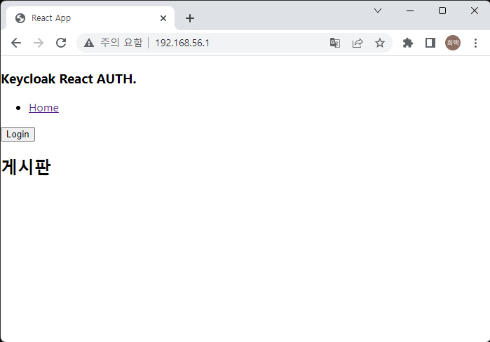

# React JS 프로젝트 빌드      
    프론트엔드 프로젝트도 빌드의 단계를 거친다.    
    빌드라고 해서 컴파일을 한다거나 하는 단계는 아니고,    
    프론트엔드 파일들이 많고 용량이 커지면 앱이나 브라우저에서 열 때 다운받아야 하는 용량이 커져서 느려질 수 잇다.    
    빌드 과정을 통해 불필요한 공백 같은걸 제거하고 파일을 콤팩트하게 만듭니다.    

1. 프로젝트 빌드    
    1. 의존성 설치   
        npm install {package} 명령어를 통해서 특정 패키지를 설치할 수 있다.    
        package.json 파일에 있는 디렉토리에서 npm install 명령어를 사용하면    
        pakcage.json 파일에 설정되어 있는 의존 라이브러리들을 설치할 수 있다.    
        node_modules 디렉토리에 의존성 라이브러리들이 많이 생긴 걸 볼 수 있다.    

        ```sh
        npm install
        ```

    2. 빌드    
        의존 라이브러리 파일 및 개발 한 파일을 컴팩트하게 하고 용량이 줄인다.    
        build 디렉토리에 빌드한 파일들이 들어있게된다.    
        ```sh
        npm run build
        ```
        빌드한 파일을 웹서버에 배포할 수 있다.    

2. nginx 배포   
    nginx 역시 docker로 실행시켜보자    
    배포를 쉽게 하기 위해서 nginx 의 리소스 디렉토리를 local 의 디렉토리를 사용하도록 한다.    
    1. docker로 띄울 nginx 의 리소스 디렉토리를 공유할 디렉토리를 생성한다.    
        ```sh
        mkdir -p ../nginx/board
        ```
    2. nginx Docker로 실행   
        ```sh
        sudo docker run --name hitec-nginx -p 80:80 -v /home/hitec/nginx/board:/usr/share/nginx/html:ro -d nginx
        ```

        > -v 옵션으로 local의 디렉토리와 docker의 nginx를 공유한다.   

        브라우저로 nginx 포트인 80으로 열어보면 다음과 같다. 
            

        > 설치되었지만 리소스가 없어 403 forbidden 으로 화면이 나온다.    

    3. reactjs 빌드 파일 nginx 에 복사   
        앞에서 빌드된 파일 build 의 파일을 서버의 Docker와 쉐어하고있는 디렉토리(/home/hitec/nginx/board) 에 복사를 한다.    
            


        다시 브라우저로 열어보면 다음과 같이 리소스가 적용되어 있다.    
            

3. jenkins로 배포    
    frontend 빌드 된 파일들을 nginx에 복사한 새로운 docker 이미지를 만들어서 배포하기로 한다.    
    앞에 설명한 것과 같이 nginx의 리소스 디렉토리를 local 서버와 공유해서 사용할 수도 있지만,    
    리소스 파일들이 모두 들어간 nginx base의 docker를 배포하는 방법도 있다.     

    1. Dockerfile 생성   

        ```Dockerfile
        FROM nginx
        COPY ./build /usr/share/nginx/html
        ```
        > nginx 이미지에 컴파일 된 리소스 파일들을 복사한다. 

    2. Jenkinsfile 생성   
        ```Jenkinsfile
         pipeline {
            agent any
            stages {
                stage('BUILD') {
                    steps {
                        sh 'npm install'
                        sh 'CI=false npm run build'
                    }
                }
                stage('STOP App') {
                    steps {
                        script {
                            try {
                                sh 'docker stop hitec-front'
                                sh 'docker rm hitec-front' 
                            } catch (err) {
                                echo err.getMessage()
                                echo 'Stop App Failed'
                            }
                        }
                    }
                }
                stage('Dockernizer') {
                    steps {
                        sh 'docker build -t hitec-front:0.0.1 .'
                    }
                }
                stage('Deployment') {
                    steps {
                        sh 'docker run -d -p 80:80 --name hitec-front hitec-front:0.0.1'
                    }
                }
            }
        }
        ```

        > hitec-front 라는 이름으로 빌드 후 실행한다. 
    > 결과는 앞서 보았던 결과와 동일하다.     

    

> 배포 후 로그인 페이지가 제대로 안 뜰 경우 CORS 이슈일 수 있음    
> Keycloak 의 해당 Client 의 설정 추가 필요    
    >> valid redirect uris : http://192.168.56.1/*   
    >> Valid post logout redirect URIs : http://192.168.56.1/   
    >> Web origins : http://192.168.56.1/   
