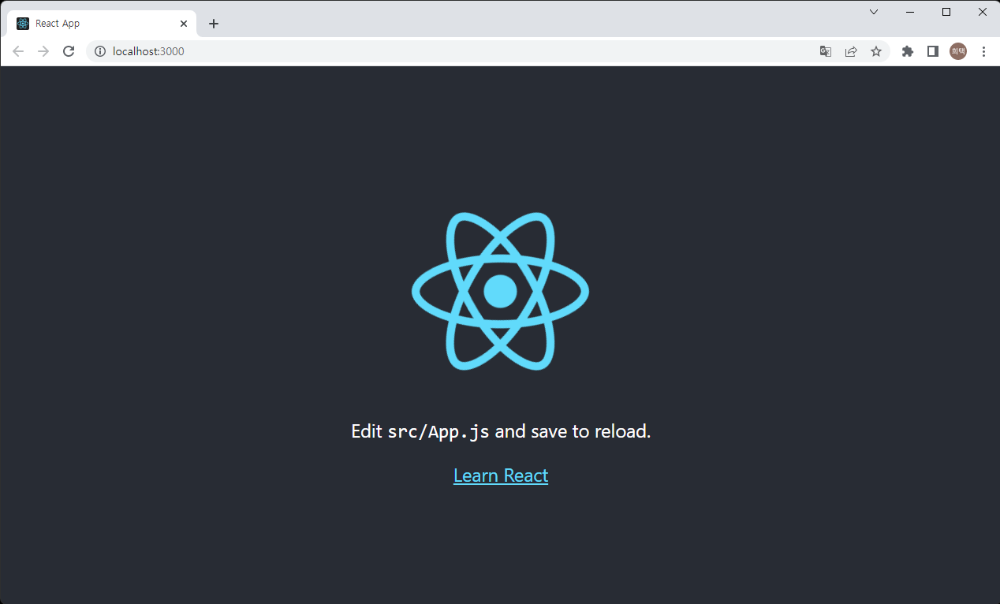
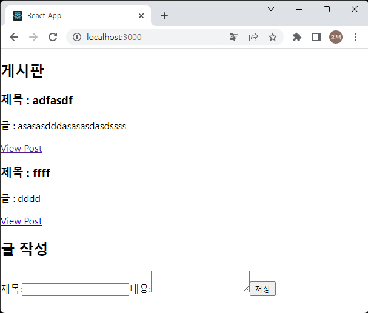

# React JS 로 SPA 시작하기   
> SPA(Single page application) vs SSR(Server Side Rendering) vs SSG(Static Site Generator)   

> SPA는 웹 페이지 리소스를 모두 받은 후 요청에 대한 데이터만 받아서 클라이언트 상에서 rendering   
> SSR은 요청에 대한 웹 페이지를 서버에서 만들어서 클라이언트로 보내는 방식   
> SSG는 웹 페이지를 모두 미리 만들어 놓고 요청 한 페이지를 보내는 방식   

> UI/UX 가 유연하고 네이티브 어플리케이션 같은 효과를 줄 수 있는 SPA 방식으로 개발   
> angular js, vue js, react js 등이 있지만 React JS를 선택하기로 했다. 

> 개인적으로 FrontEnd 개발은 전문으로 하지 않아서 미흡한 부분이 많을 듯 하다....
> 계속 공부하면서 발전하고자 한다.

1. Node JS 설치
    > front end 개발에도 필요한 라이브러리들이 있고, 테스트를 실행해볼 수 있어야 한다.    
    > 그런 기능들을 지원해주는 npm 을 사용하기 위해서 nodejs를 설치한다.    
    1. nodejs 다운로드 [Nodejs 다운로드](https://nodejs.org/en/)   
        LTS 혹은 Current 버전을 다운로드 (LTS 가 안정화 버전)
    2. 다운로드 받은 파일 더블클릭 
    3. 넥스트 열심히 누르면 설치 완료   
    4. 설치확인   
   
        ```
        node -v
        npm -v
        ```
        버전 정보가 나오면 설치 완료   

2. react 프로젝트 생성   
    1. 프로젝트를 위한 디렉토리를 생성 후 프로젝트 생성   
        ```sh
        npx create-react-app <app name>
        ex) npx create-react-app hitec-front
        ```
        > npm start : 개발 장비에서 개발 된 페이지를 볼수 있는 서버 동작   
        > npm run build : 운용장비에 적용하기 위한 정적 리소스 생성    
    2. 프로젝트 확인   
        프로젝트 디렉토리에서 터미널을 열고 아래 명령어 입력 후 브라우저 확인   
        ```sh
        npm start
        ```
           

3. 화면 콤포넌트 생성   
    1. 컴포넌트 생성   
        게시판에 대한 컴포넌트를 생성하려고 한다. 어떤 화면이 필요할까??   
        게시글 리스트 화면 - boardList   
        게시글 상세 화면 - boardPage    
        게시글 작성화면 - addBoardForm   
        게시글 수정화면 - editBoardForm   

        ```js
        //BoardList.js
        import React, { useEffect } from 'react'
        import { useSelector, useDispatch } from 'react-redux'
        import { Link } from 'react-router-dom'

        import { fetchBoardList } from './boardSlice'

        export const BoardList = () => {
            const boardList = useSelector((state) => state.board.boardList);
            const listStat = useSelector((state) => state.board.listStat);
            const dispatch = useDispatch();

            useEffect(() => {
                if(listStat === 'idle'){
                    dispatch(fetchBoardList());
                }
            }, [listStat])

            const renderedBoard= boardList.map((board) => {
                return (
                <article className="excerpt" key={board.id}>
                    <h3>제목 : {board.title}</h3>
                    <p className="content">글 : {board.content.substring(0, 100)}</p>

                    <Link to={`/board/${board.id}`} className="button muted-button">
                    View Post
                    </Link>
                </article>
                )
            })

            return (
                <section className="board-list">
                <h2>게시판</h2>
                {renderedBoard}
                </section>
            )
        }

        ```
        > 게시글의 리스트를 볼 수 있는 화면   
        > useSelector, useDispatch 는 리덕스 함수로 전역으로 설정되어 있는 상태를 가져오거나 전역으로 설정 된 함수를 실행 할 때 사용   
        > useEffect는 리액트 함수로 콤포넌트의 변화 및 props 의 변화에 따라 특정 로직을 수행 할 수 있다.    

        ```js
        //BoardPage.js
        import React, { useEffect } from 'react'
        import { useSelector, useDispatch} from 'react-redux'
        import { Link, useParams } from 'react-router-dom'

        import { fetchBoard } from './boardSlice'

        export const BoardPage = () => {
            const { id } = useParams();
            
            const dispatch = useDispatch();

            const board = useSelector((state) => state.board.currentBoard);

            useEffect(() => {
                dispatch(fetchBoard(id));
            }, [id])


            if (!board) {
                return (
                <section>
                    <h2>Post not found!</h2>
                </section>
                )
            }

            return (
                <section>
                <article className="board">
                    <h2>제목 : {board.title}</h2>
                    <p className="content">글 : {board.content}</p>
                    <Link to={`/editboard/${board.id}`} className="button"> 수정 </Link>
                </article>
                </section>
            )
        }
        ```
        > 게시글의 상세페이지   
        > userParams, Link 는 react route dom 의 함수로 페이지가 넘어오 올 때 파라미터를 가져오는 함수와 다른 페이지로 변경하기 위한 함수이다. 

        ```js
        //AddBoardForm.js
        import React, { useState } from 'react'
        import { useDispatch } from 'react-redux'
        import { addBoard } from './boardSlice'

        export const AddBoardForm = () => {
            const [title, setTitle] = useState('')
            const [content, setContent] = useState('')

            const dispatch = useDispatch()

            const onTitleChanged = (e) => setTitle(e.target.value)
            const onContentChanged = (e) => setContent(e.target.value)

            const onSaveClicked = () => {
                if (title && content) {
                dispatch( addBoard({ title, content, }))
                setTitle('')
                setContent('')
                }
            }

            return (
                <section>
                <h2>글 작성</h2>
                <form>
                    <label htmlFor="title">제목:</label>
                    <input type="text" id="title" name="title" value={title} onChange={onTitleChanged} />
                    <label htmlFor="content">내용:</label>
                    <textarea id="content" name="content" value={content} onChange={onContentChanged} />
                    <button type="button" onClick={onSaveClicked}> 저장 </button>
                </form>
                </section>
            )
        }
        ```
        > 새로 글을 작성하는 화면   
        > useState 는 콤포넌트 내부에 변수를 설정하고 변수에 값을 세팅하기 위한 함수이다.    
        > 리액트는 변수의 값을 변경하지 않고, 새로운 값으로 세팅해야한다. 

    2. 디렉토리 설정   
     새로운 기능이 생길 때 features 아래에 디렉토리로 생성   
     ```
     /src
         index.js: the starting point for the app
         App.js: the top-level React component
         /app
             store.js: creates the Redux store instance
         /features
             /board
                 AddBoardForm.js: 게시글 작성 콤포넌트 
                 EditBoardForm.js: 게시글 수정 콤포넌트
                 BoardList.js: 게시글 리스트 콤포넌트
                 BoardPage.js: 게시글 상세화면 콤포넌트
                 boardSlice.js: the Redux logic 
     ```
     > store.js, boardSlice.js 는 redux 사용을 위한 파일임   

4. React Router 적용   
    1. react router dom 설치 
        react 에서 페이지 전환을 도와주는 React Router 설치 및 적용   
        ```sh
        npm install react-router-dom
        ```

    2. Browser Router 적용 
        App.js 파일을 수정   

        ```js
        import React from 'react';

        import { BrowserRouter, Routes, Route } from 'react-router-dom'

        import { AddBoardForm } from './features/board/AddBoardForm.js'
        import { EditBoardForm } from './features/board/editBoardForm'
        import { BoardList } from './features/board/boardList'
        import { BoardPage } from './features/board/boardPage'

        function App() {
        return (
            <BrowserRouter>
            <div className="App">
                <Routes>
                <Route exact path="/" element={<BoardList />} />
                <Route exact path="/board/:id" element={<BoardPage/>} />
                <Route exact path="/editboard/:id" element={<EditBoardForm/>} />
                <Route exact path="/board" element={<AddBoardForm/>} />
                </Routes>
            </div>
            </BrowserRouter>
        );
        }

        export default App;

        ```
        > BrowserRouter 를 통해 화면이 전환이 된다. 
        > Routes 항목 중 Route path 와 동일한 URL 을 가지면 설정된 element 의 화면이 보여지게 된다.    
        > Link 등의 사용하여 화면 전환을 할 수 있다. 

5. 리덕스 설정   
    리액트로 개발할 때 상태관리를 해주면서 프로젝트를 좀 더 효율적으로 구성할 수 있게 도와주는 라이브러리이다.   
    1. 리덕스 설치   
        react 개발 디렉토리에서   
        ```sh
        npm i react-redux
        npm i redux
        npm i @reduxjs/toolkit
        ```

    2. 스토어 생성 (store.js)   
        전역 상태를 관리하기 위한 store 를 생성   
        feature를 생성하면 store 에 추가한다.    

        ```js
        import { configureStore } from '@reduxjs/toolkit'
        import boardSlice from '../features/board/boardSlice'

        export default configureStore({
            reducer: {
                board: boardSlice
            }
        })
        ```
    
    3. index.js 파일에 App 전체를 Provider store 로 감싸기   
        ```js
        import React from 'react';
        import ReactDOM from 'react-dom/client';
        import './index.css';
        import App from './App';
        import store from './app/store'
        import { Provider } from 'react-redux'

        const root = ReactDOM.createRoot(document.getElementById('root'));
        root.render(
        <React.StrictMode>
            <Provider store={ store }>
            <App />
            </Provider>
        </React.StrictMode>
        );
        ```

    4. 리덕스의 리듀셔와 액션 생성 (Slice)   
        리덕스는 상태가 변할 때 action 을 발생시키며   
        action 에 따라 상태의 변화를 발생시키는 reducer로 구성되어 있다.   
        리덕스 툴킷을 사용하면 액션과 리듀서를 만드는게 쉬워진다.    

        ```js
        import { createSlice, createAsyncThunk } from '@reduxjs/toolkit'
        import axios from 'axios'

        const initialState = {
            boardList: [],
            listStat: 'idle',
            currentBoard: null,
            error: null
        }

        export const fetchBoardList = createAsyncThunk('board/boardList', async () => {
            const response = await axios.get('http://192.168.56.1:8899/boards');
            return response.data;
        })

        export const fetchBoard = createAsyncThunk('board/board', async (id) => {
            const response = await axios.get('http://192.168.56.1:8899/board/'.concat(id));
            return response.data;
        })

        export const addBoard = createAsyncThunk('board/addBoard', async (boardObj) => {
            const response = await axios.post('http://192.168.56.1:8899/board', boardObj);
            return response.data;
        })

        export const editBoard = createAsyncThunk('board/editBoard', async (boardObj) => {
            const response = await axios.put('http://192.168.56.1:8899/board', boardObj);
            return response.data;
        })

        const boardSlice = createSlice({
            name: 'board',
            initialState,
            reducers: {},
            extraReducers(builder) {
                builder
                    .addCase(fetchBoardList.fulfilled, (state, action) => {
                        state.boardList = action.payload;
                        state.listStat = 'successed';
                    })
                    .addCase(fetchBoard.fulfilled, (state, action) => {
                        state.currentBoard = action.payload;
                    })
                    .addCase(addBoard.fulfilled, (state, action) => {
                        state.currentBoard = action.payload;
                        state.listStat = 'idle';
                    })
                    .addCase(editBoard.fulfilled, (state, action) => {
                        state.currentBoard = action.payload;
                        state.listStat = 'idle';
                    })
            }
        })

        export const { postUpdated } = boardSlice.actions;

        export default boardSlice.reducer

        ```
        > createSlice 를 통해 actions 와 reducers 를 생성   
        > 외부 통신은 axios 를 사용하며 리덕스에서 외부 연동을 위해 thunk를 사용 (npm install axios)
    
6. 서버는 앞서 만든 스피링으로 서버 만들기에서 만든 서버를 사용
       
    > 디자인은 엉망이지만 작동은 잘 한다.    
    > 기능도 정말 단순하다. 하지만 단순한 것에서부터 출발하는거다...