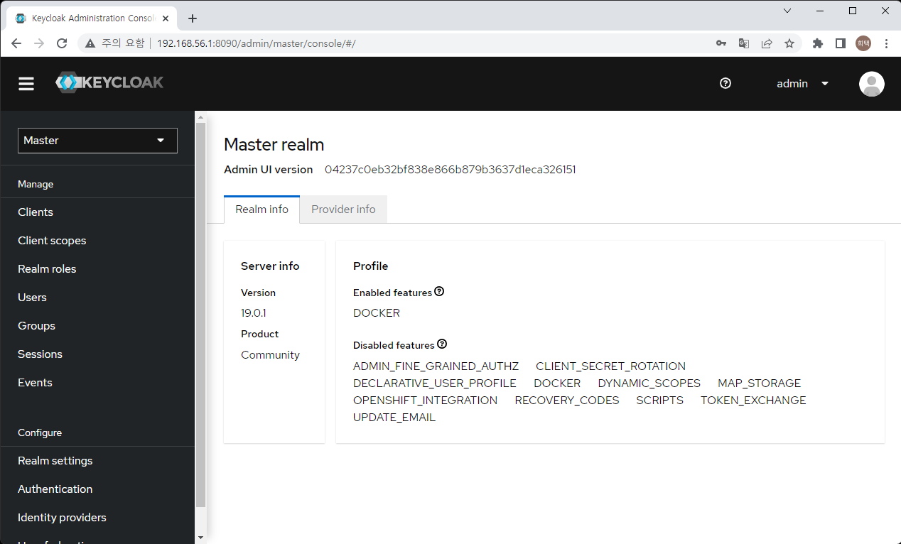
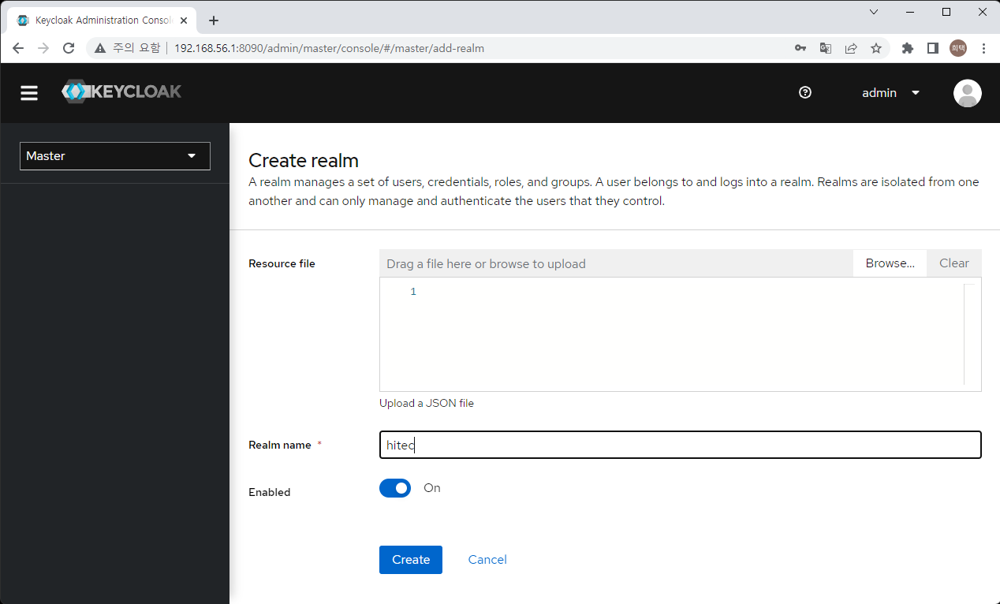
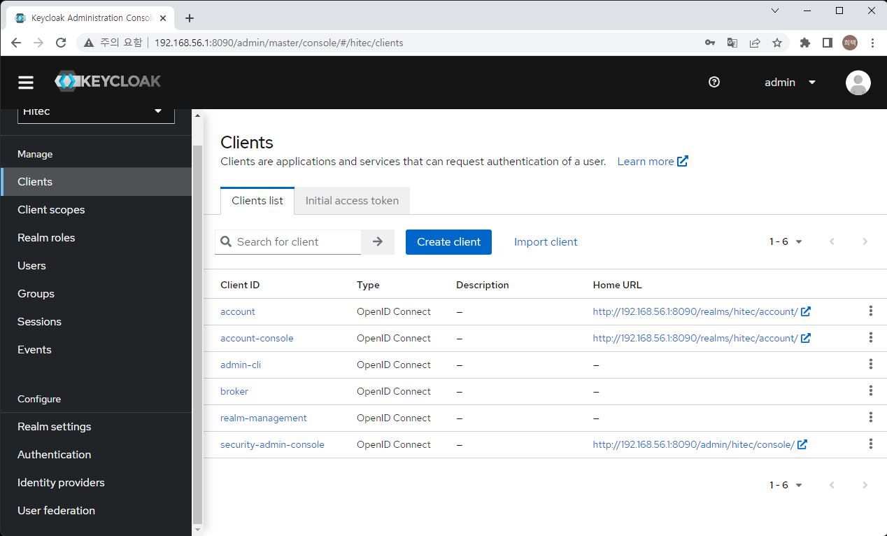
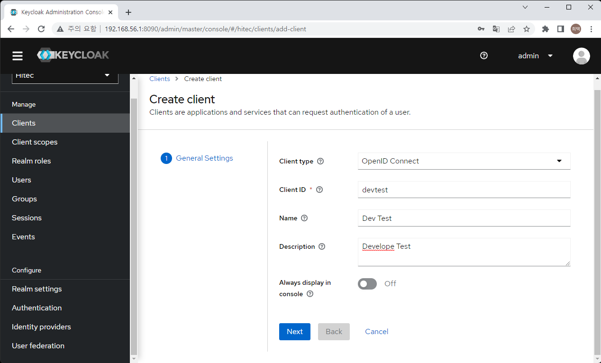
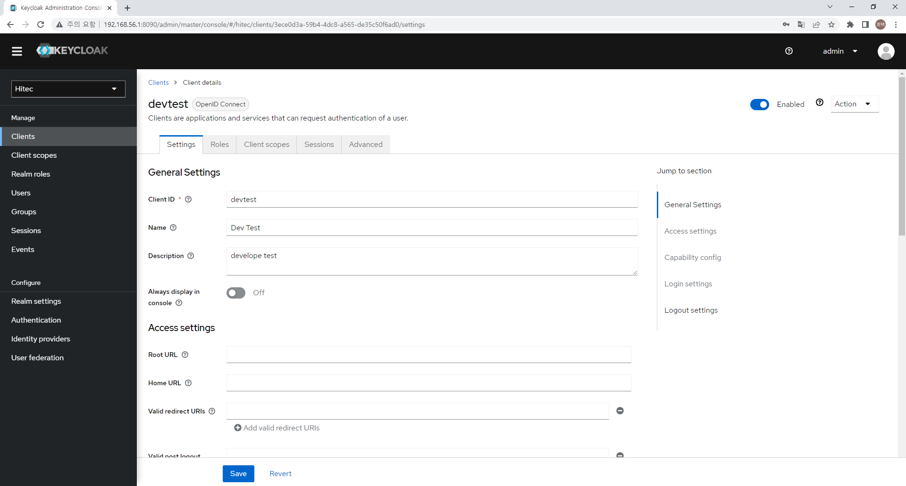

# Keycloak 으로 회원가입   

> 회원가입을 만들어 보자.    
> 대부분의 서비스에서 기본으로 만들어야 하는 서비스이다.   
> MSA 정신을 바탕으로 회원가입을 따로 마이크로서비스로 만든다.    
> 직접 만들수도 있다. spring, node, python 등을 통해 DB를 연결하고 회원을 받고 저장하고, 키를 발급하고...
> 그걸 만들어 놓은 오픈 소스가 있다. 개인 개발자라면 만들어 놓은 걸 쓰는게 아무래도 좋겠다.   
> Keycloak 을 설치하고 설치하고 연동을 해보자.   

1. Keycloak Docker로 실행 ([keycloak Doc](https://www.keycloak.org/server/containers "Keycloak Dock"))    
    > 이것도 docker로 실행하자    
    > 물로 개발환경이기때문에 개발 용으로 설치한다.   
    > 운용에서의 설치 방법은 따로 확인 필요   

    ```sh
    sudo docker run -d --name hitec-keycloak -p 8090:8080 -e KEYCLOAK_ADMIN=admin -e KEYCLOAK_ADMIN_PASSWORD=1234 quay.io/keycloak/keycloak start-dev
    ```

    > virtualbox 네트워크 설정에서 port fowarding 확인    

        

2. Administration Console 선택   
    > keycloak을 관리하기 위한 화면   
    > docker 실행 시 입력한 admin 이름과 비밀번호로 로그인    

        

3. 신규 realm 생성   
    > realm 은 계정 체계 이며 realm 은 여러 client를 가질 수 있고,   
    > client 별 로그인은 동일 realm 에서 sso 로그인이 된다.    

    1. 좌측 select 박스 선택 (초기에는 Master 만 있고 Master만 선택되어 있음)    
        > select 박스 내 "Create Realm" 을 선택   

            
    2. Realm name 을 정하고 생성   

4. client 생성   
    1. 좌측 Client 메뉴 선택   

            
    2. create client 선택   
        > client Id, name description 입력   

            
    3. client 인증방식 설정   
            

    4. client 설정   
        > client 설정 화면이며 이 화면은 좌측의 client 메뉴 화면에서 설정하고자 하는 cleint를 선택하면 설정화면이 나옴   
        
            

