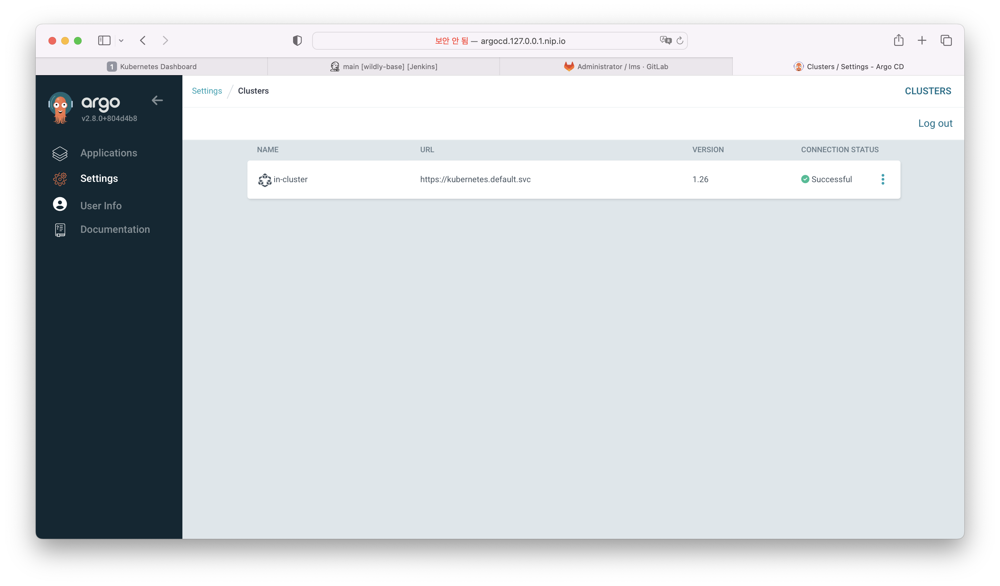
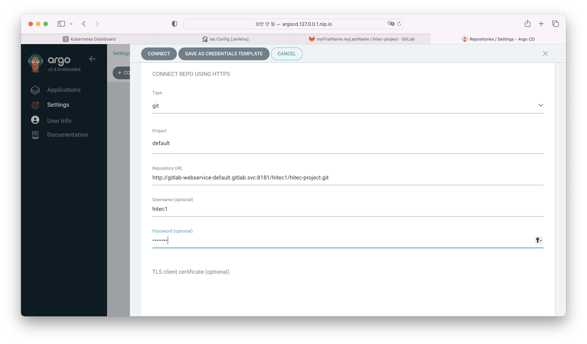
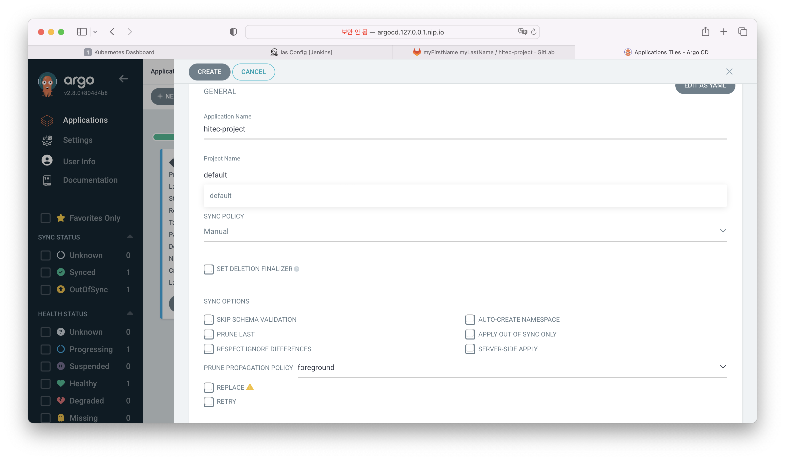
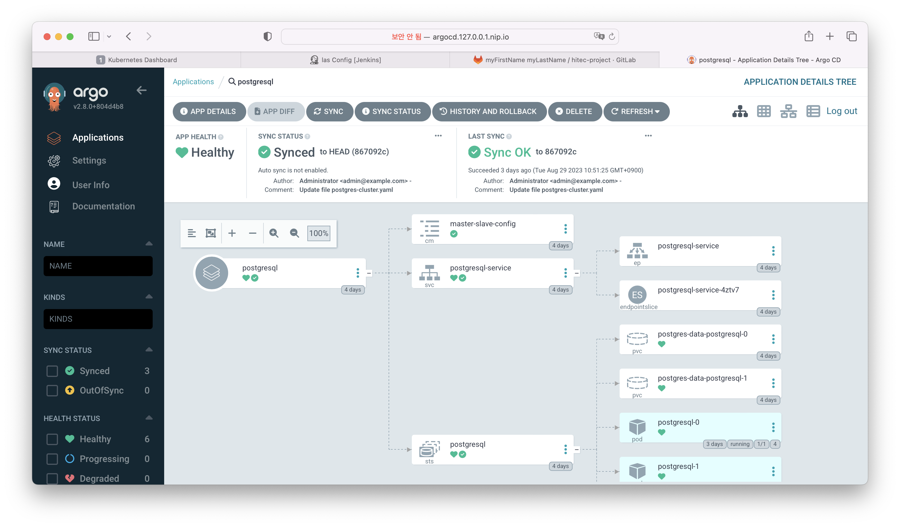

# minikube argocd 배포 

## kubernetes에 argocd로 배포 
컨테이너화하여 생성된 이미지를 kubernetes에 배포한다.    
기본적인 script 파일(yaml) 작성법은 생략한다. (쿠버네티스 강좌 참조)   
argocd 라는 툴을 통해 kubernetes에 어떻게 배포가 되는지 설명 하려고한다.     

1. argocd cluster 설정   
  argocd 툴이 배포하려고 하는 쿠버네티스 클러스터를 설정한다.    
  좌측메뉴 Settings -> Clusters 선택    

      
  
  > 같은 쿠버네티스에 설정되어 있어 기본으로 설정할 수 있다.    

2. argocd repository 설정     
  gitops 설정으로 배포 스크립트는 gitlab에서 관리한다.    
  스크립트 파일이 저장되어 있는 git 저장소를 설정한다.   
  좌측메뉴 Settings -> Repositories 선택    

     

  > 타입은 git과 helm이 있다. git으로 관리하거나 helm으로 관리할 수 있다.    
  > 프로젝트를 선택한다.    
  > 쿠버네티스 스크립트가 저장되어 있는 git의 저장소를 입력한다. (gitlab이 같은 kubernetes에 설치되어 있다면 gitlab의 서비스 이름으로 설정한다. )   
  > gitlab의 username, password를 설정한다.    

3. application create
  실제 배포를 수행하는 Application을 생성한다.    
  배포 소스와 destination 을 설정하고 기본적인 옵션들을 설정한다.    
  좌측메뉴 Applications -> New App 선택    

     

  > General - Application Name, Project Name 및 여러 옵션들을 설정한다.    
  > SOURCE - repository 에서 생성한 위치를 선택하고 브랜치 및 파일의 디렉토리 위치를 설정한다.    
  > DESTINATION - cluster에서 생성한 클러스터를 선택하고, 네임스페이스를 설정한다.    

4. 배포확인    
  SYNC 버튼을 통해서 동작하며 자동으로 스크립트 파일을 읽어서 배포를 진행한다.    
     
  > 설정 내용으로 제대로 배포되고 있는지 화면을 통해 확인 할 수 있다.    

