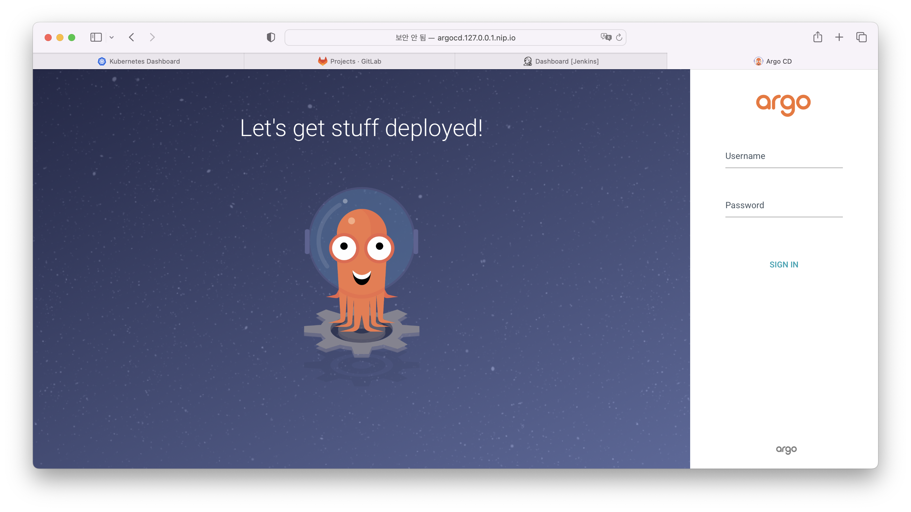

# minikube ArgoCD 설치 

## helm을 통해 argocd 설치 (출처 : [argocd install][argocd install]  )

   [argocd install]: https://argo-cd.readthedocs.io/en/stable/operator-manual/installation/ "argocd install"     

1. chart 가져오기      
    1. helm chart를 가져오기 위해 repository를 등록한다.       
    ```
    helm repo add argo-cd https://argoproj.github.io/argo-helm
    helm search repo argo
    ```
    2. argocd chart를 가져온 압축되어 있는 파일의 압축을 푼다.       
    ```
    helm pull argo-cd/argo-cd
    tar xvzf ./*.tgz
    ```
2. 설치 옵션 변경   
    새로 values-override.yaml 파일을 만들고 수정될 부분만 새로 작성한다.    

    ```yaml
    configs:
      params:
        server.insecure: true
    server:
      ingress:
        enabled: true
        annotations:
          nginx.ingress.kubernetes.io/backend-protocol: HTTP
        hosts:
          - "argocd.127.0.0.1.nip.io"
    ```
    > server.insecure - 초기 설치 옵션이 https 방식으로 되어 있으며 http 로 서버에 접근하기 위해 true로 설정    
    > ingress 설정 - 초기 설정 옵션이 ingress가 설정되어 있지 않음   
    > hosts - gitlab, jenkins의 도메인과 맞추어 host를 지정   

3. namespace 생성   
    argocd에서 사용할 namespace를 생성한다.    
    ```
    kubectl create namespace argocd
    ```

4. argocd 설치   
    helm 형태로 argocd를 설치한다.    
    ```
    helm upgrade argocd --namespace argocd . -f ./values-override.yaml
    ```
5. argocd 설치 확인   
    URL http://argocd.127.0.0.1.nip.io 를 통해 argocd 접근   
       

    초기 유저는 admin 이며    
    초기 비밀번호는    
    ```
    kubectl -n argocd get secret argocd-initial-admin-secret -o jsonpath="{.data.password}" | base64 -d
    ```
    명령어를 통해 확인할 수 있다.    