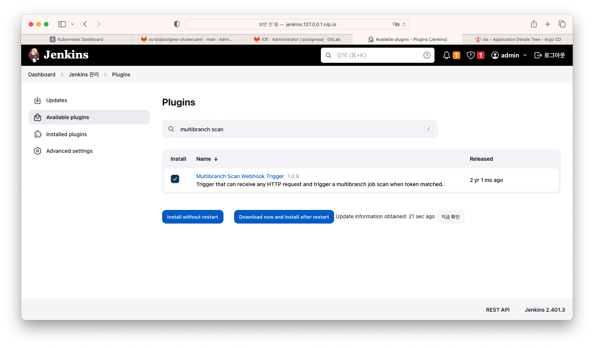
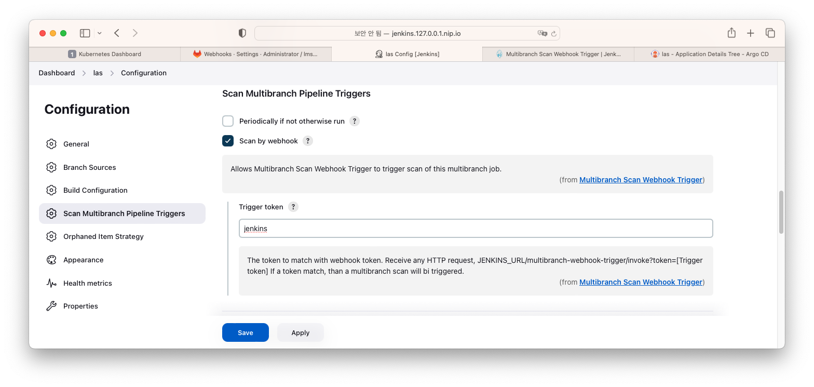
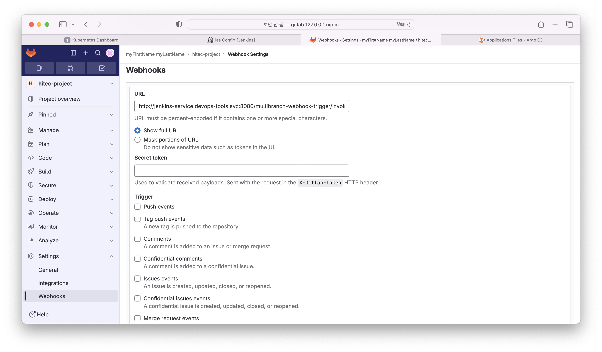
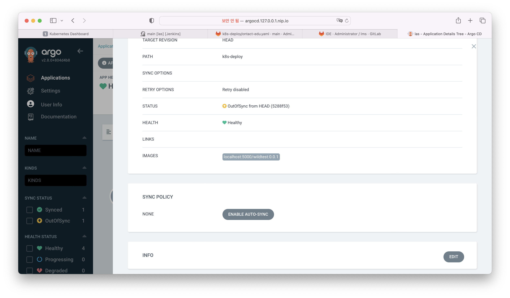

# kubernetes cicd 자동화    

## 빌드 배포 자동화    
툴을 통해 빌드 및 배포를 설정하였다.    
하지만 개발과정에서 일일이 툴을 실행시켜서 빌드를 하고 배포를 해야한다면 번거로울 수 밖에 없다.   
개발자가 소스를 gitlab에 push하면 jenkins가 자동으로 빌드를 수행하고 argocd를 통해 배포까지 하게된다면 많은 부분 수월할 수 있다.    

개발, 스테이징, 상용 등으로 구분되어지는 경우에는 브랜치를 활용하여 브랜치별 빌드 배포 등의 방법을 사용할 수 있다. 그 방법은 추후에 기회가 되면 다시 작성하고자 한다.     

1. Gitlab -> Jenkins 웹 훅 설정   
git으로 소스가 push 될 때 jenkins로 웹 형태의 호출을 보내게 설정한다.    
jenkins는 웹 형태의 호출을 통해 자동으로 프로젝트 빌드를 수행 할 수 있다.    

    1. jenkins plugin 설치   
    jenkins 관리 -> Plugins -> Available Plugins에서 multibranch scan 으로 검색하여 설치한다.       
       
    > jenkins job은 multibranch pipeline으로 생성되어야한다.    

    2. jenkins job 설정   
    설정하고자 하는 프로젝트를 선택하고 좌측의 Configure 를 선택하여 설정화면으로 진입한다.    
    multibranch scan 플러그인이 정상으로 설치가 되었다며 설정 하단에 Scan Multibranch Pipeline Triggers 항목이 나오게 된다.    

       
    > scan by webhook을 선택한다.    
    > trigger token을 설정한다. (gitlab설정에 동일한 값으로 세팅해야하며 임의로 설정할 수 있다. )   

    3. gitlab project webhook 설정   
    프로젝트 목록에서 설정하고자 하는 프로젝트를 선택한다.    
    좌측의 settings -> webhooks 를 선택   
    add new webhook을 선택한다.    
       

    > URL - http://jenkins-service.devops-tools.svc:8080/multibranch-webhook-trigger/invoke?token=hitecproject
    > Jenkins URL 은 동일 쿠버네티스 내부에 설치 될 경우 service의 경로로 설정한다.    
    > token 은 젠킨스에서 trigger token에서 설정한 값과 동일하게 설정한다.    
    > 웹 훅을 날릴 여러 트리거를 설정할 수 있다. 기본으로 push events를 설정한다.    
    > TLS 설정을 하지 않았다면 Enable SSL verification 체크는 해제한다. 

    웹 훅을 설정 한 후 테스트 버튼을 통해 웹 훅을 보내 볼 수 있다. 젠킨스에서 설정한 프로젝트가 빌드를 진행 하는지 확인할 수 있다.    
    설정한 트리거의 이벤트가 발생할 때 웹 훅을 보내고 젠킨스에서는 자동으로 빌드를 수행한다.    

2. gitlab -> argocd 자동배포   
    argocd 에서는 설정된 git 저장소로 매 3분마다 변경사항을 확인 한다고 한다.    
    현재의 버전과 git의 버전이 다른 경우 status는 outOfSync 가 되며,   
    Sync Policy가 auto 일 경우 자동으로 수정 배포하게 된다.    
    manual 인 경우 관리자가 직접 SYNC를 수행해 주어야한다.    
       
    > 개발 상태에 따라 버전을 다르게 적용하고 스크립트의 버전을 수정 할 경우 argocd에서 변경을 감지 할 수 있다.    
    > 그 외 다양한 방법이 있을 수 있다.    

