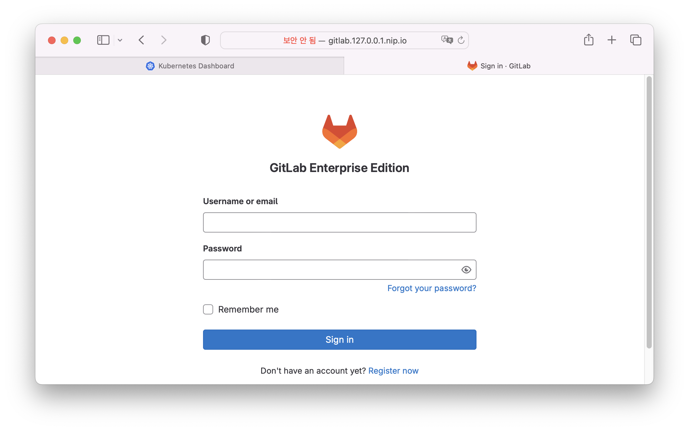
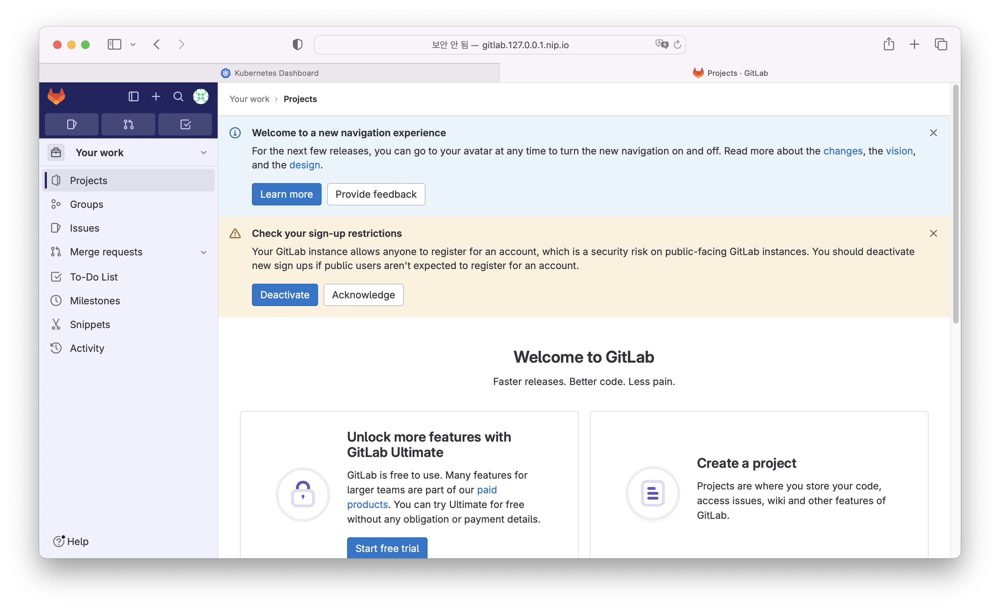

# kubernetes gitlab 설치 

## helm을 통한 gitlab 설치 (출처 : [gitlab install][gitlab install]  )

   [gitlab install]: https://docs.gitlab.com/charts/development/minikube/ "Gitlab install"     

1. helm chart 가져오기      
    로컬PC의 적당한 위치에서 git을 통해 helm chart를 가져온다.    
    ```
    git clone https://gitlab.com/gitlab-org/charts/gitlab.git
    cd gitlab
    ```

2. minimal 설치   
    로컬PC에서 실행하는 한계로 미니멀하게 설치하려고한다.    
    
    1. minimal 설치를 위해 만들어 놓은 values-minikube-minimum.yaml 파일을 받는다.    
    ```
    curl -O https://gitlab.com/gitlab-org/charts/gitlab/raw/master/examples/values-minikube-minimum.yaml
    ```

    2. namespace를 생성한다.    
    ```
    kubectl create namespace gitlab
    ```
    > gitlab이라는 이름의 namespace를 생성한다.    

    3. helm chart를 통해 gitlab을 설치한다.    
    ```
    helm dependency update
    helm upgrade --namespace gitlab --install gitlab . --timeout 600s -f values-minikube-minimum.yaml --set global.hosts.domain=127.0.0.1.nip.io --set global.hosts.externalIP=127.0.0.1 --set global.ingress.tls.enabled=false --set global.hosts.https=false
    ```
    > --namespace gitlab - gitlab namespace에 설치   
    > --install gitlab  - helm 이름은 gitlab으로 설정   
    > -f values-minikube-minimin.yaml - 최소설치로 설치   
    > --set global.hosts.domain=127.0.0.1.nip.io - ip는 127.0.0.1로 도메인을 설정   
    > --set global.hosts.externalIP=127.0.0.1 - external ip는 127.0.0.1로 설정   
    > --set global.ingress.tls.enabled=false - https를 위한 tls를 사용하지 않음   
    > --set global.hosts.https=false - https 통신을 사용하지 않음   

    > ip는 minikube의 IP를 설정하라고 가이드 되어 있으나 127.0.0.1로 설정할 때 로컬 PC에서 접근가능   
    > https통신이 기본이나 태부 학습 및 테스트 용도임으로 https통신을 사용하지 않음    


3. 설치 확인   
    minikube tunnel이 실행되어 있는 상태에서    
    url http://gitlab.127.0.0.1.nip.io 
       

    admin 유저는 'root' 이며 
    초기 비밀번호는 
    ```
    kubectl --namespace gitlab get secret gitlab-gitlab-initial-root-password -ojsonpath='{.data.password}' | base64 --decode ; echo
    ```   
    위 명령어로 확인할 수 있다.    

    아래와 같이 초기 로그인 화면을 확인 할 수 있다.    
       