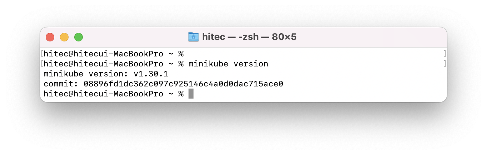
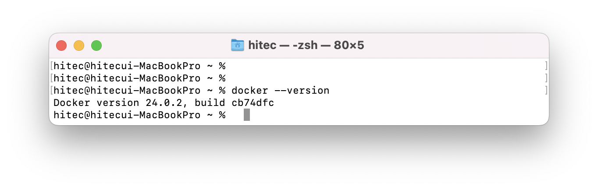
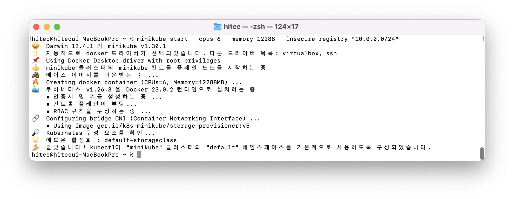
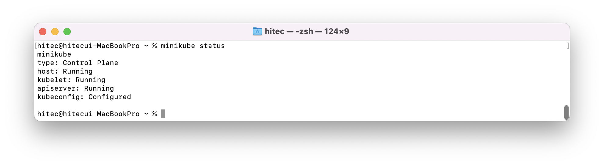
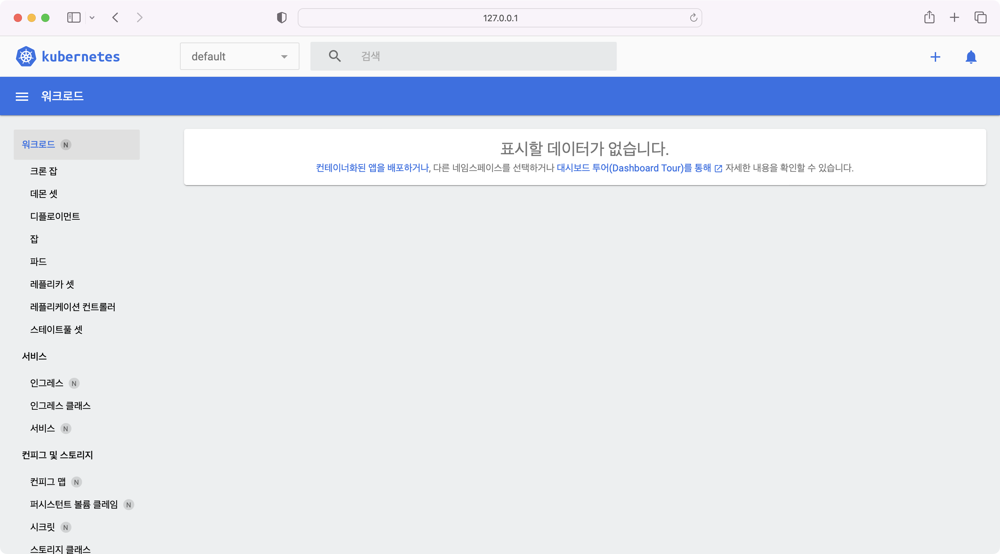
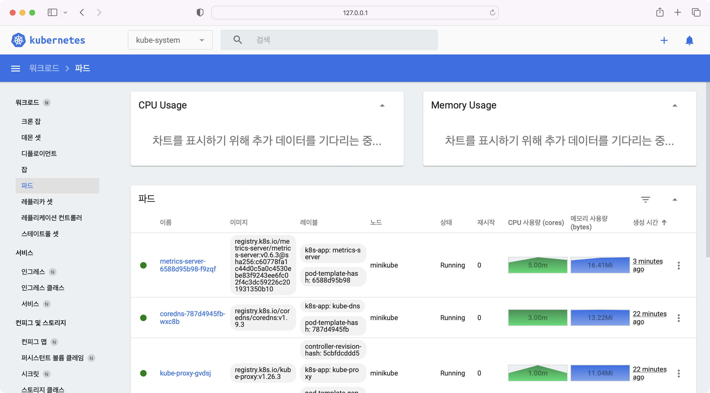

# minikbue 설치   

## minikube 기동 

1. minikube 설치 (출처 : [minikube install][minikube install]  )

   [minikube install]: https://minikube.sigs.k8s.io/docs/start/ "Minikube"   

    1. 출처의 사이트에서 해당하는 OS 와 아키텍처를 선택 후 실행    
        ```sh
        curl -LO https://storage.googleapis.com/minikube/releases/latest/minikube-darwin-amd64
        sudo install minikube-darwin-amd64 /usr/local/bin/minikube
        ``` 
        > 인텔 맥북에서 설치 예시 
    2. 설치 확인  
        minikube 의 버전정보 요청으로 설치가 잘 되었는지 확인한다. 
           

2. minikube 기동   
    minikube는 다양한 vm driver에서 기동할 수 있다. (Docker, QEMU, Hyperkit, Hyper-V, KVM, Parallels, Podman, VirtualBox, or VMware Fusion/Workstation)   
    여기서는 docker 컨테이너로 기동해보려고한다. 
    1. docker 설치 확인   
           
        > 설치가 안되어있을 경우 docker 설치 (docker install [docker install]  )

        [docker install]: https://docs.docker.com/desktop/install/mac-install/ "Docker"   
    
    2. minikube 기동   
        ```
        minikube start 
        ex) minikube start --cpus 6 --memory 12288 --insecure-registry "10.0.0.0/24"
        ```
        minikube를 기동하며 다양한 옵션을 줄 수가 있다.예제에서는 6코어 12기가를 할당했다.        
        > --cpus : 할당할 코어수   
        > --memory : 할당할 memory size   
        > --disk-size : 할당할 디스크 크기   
        > --insecure-registry : minikube의 docker registry를 사용할 때 http 사용

    3. minikube 기동 확인   
           
           
        > minikube status를 통해 상태 확인   

3. minikube dashboard
    minikube의 정보를 보여주는 대시보드가 있으며 대시보드는 아래 명령어 실행 후 URL로 접속가능
    ```
    minikube dashboard --url
    ```
       
    이미지에 있는 URL로 브라우저에서 열어보면 
       
    > 브라우저에서 노드 및 파드, 서비스, 퍼시스트볼륨 등을 확인할 수 있는 대시보드가 뜬다.    

    metrics-server 애드온을 활성화 할 경우 dashboard에서 노드 및 파드의 metric 정보를 확인 할 수 있다.    
    ```
    minikube addons enable metrics-server
    ```
       

4. ingress controller 활성화   
    minikube 에는 애드온으로 ingress를 제공한다.    
    ```
    minikube addons enable ingress
    ```

5. minikube에서 배포되어 있는 서비스 접근   
    minikube 는 일반 kubernetes처럼 바로 nodeport 나 ingress로 접근을 할 수 없다.    
    터널을 열어주거나 service를 연결해주어야한다.    
    1. tunnel (출처 : [minikube tunnel][minikube tunnel]  )

    [minikube tunnel]: https://minikube.sigs.k8s.io/docs/commands/tunnel/ "Minikube Tunnel"   

    ```
    minikube tunnel
    ```
    LoadBalancer 타입의 서비스 혹은 Ingress 설정 되어 있는 cluster ip로 라우팅   
    
    2. service 설정   
    ```
    minikube service <service name>
    ```
    특정 서비스에 바로 접근하고자 할 때 minikube service를 명령어를 통해 접근할 수 있는 URL을 받을 수 있다.    

6. minikube 중지 삭제   
    1. 중지   
    기동 중인 minikube를 중지한다.   
    minikube start를 통해 재기동 할 수 있다.    
    ```
    minikube stop
    ```

    2. 삭제   
    모든 내역을 다 삭제한다.    
    ```
    minikube delete --all
    ```