# minikube Jenkins 빌드     

## kubernetes에서 Jenkins 로 빌드 설정   
kubernetes에 설치되어 있는 Jenkins에서 소스를 빌드하는 방법을 설명한다.     
kubernetes에서 pod를 생성하여 pod 내 컨테이너를 활용하여 빌드 및 명령어를 수행한다.    

1. kubernetes plugin 설치    
kubernetes 환경에서 빌드를 수행하기 위해서 kubernetes plugin 을 설치해야한다.    
Jenkins 관리 -> Plugins -> Available plugins 화면에서 kubernetes 검색   
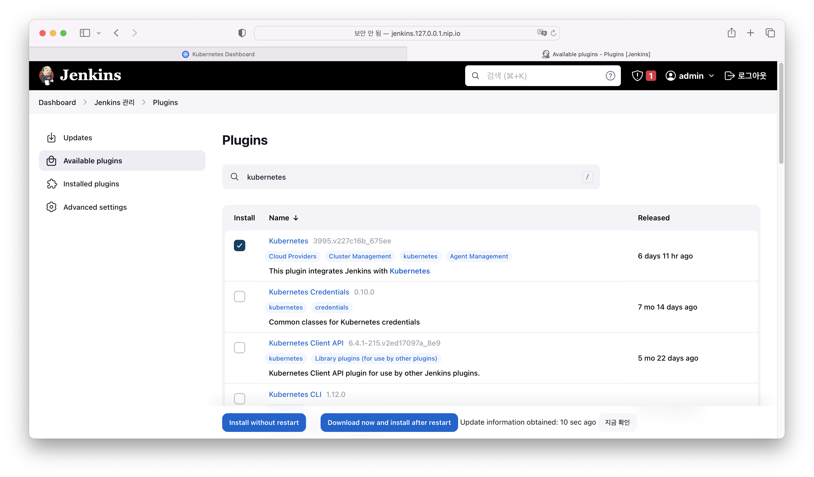   
설치 후 재기동 체크박스를 통해 설치 후 젠킨스 재기동   
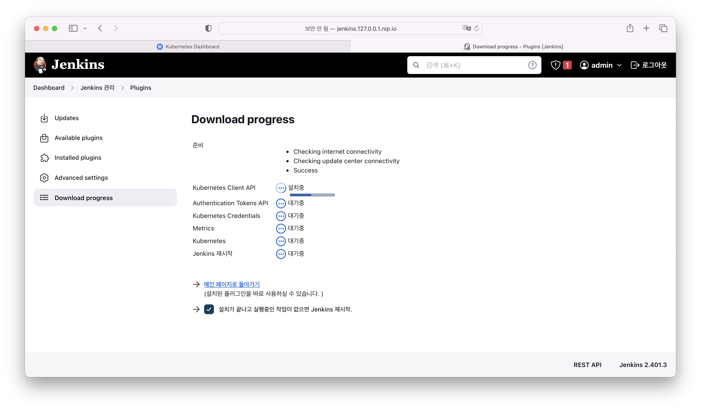   
2. jenkins cloud 설정   
kubernetes에 연결해서 빌드를 수행하기 위한 설정   
Jenkins 관리 -> Nodes and Clouds 화면에서 좌측의 Clouds 선택    
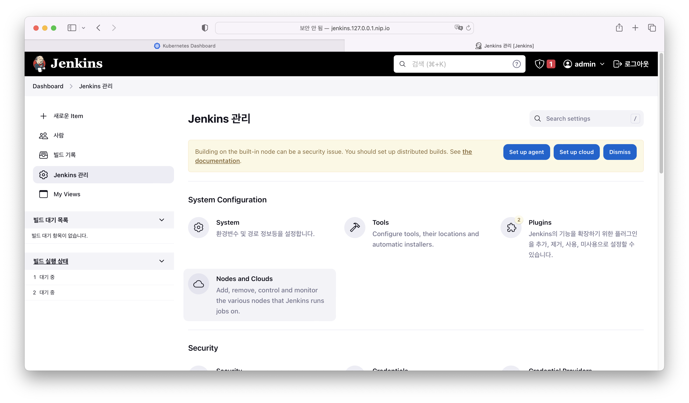   
cloud를 생성하고 kubernetes의 이름만 설정한다.    
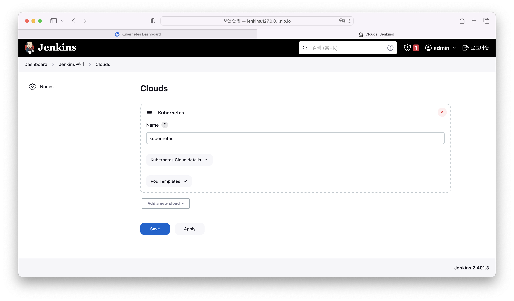   
    > 동일 kubernetes에 설치가 되어 있기때문에 다른 설정은 생략   
3. multibranch pileline 잡 생성   
jenkins의 job을 생성하는 방법은 여러가지가 있다.    
여기서는 브랜치별로 다르게 빌드할 수 있게 파이프라인을 작성할 수 있는 multibranch pipeline 으로 생성한다.    
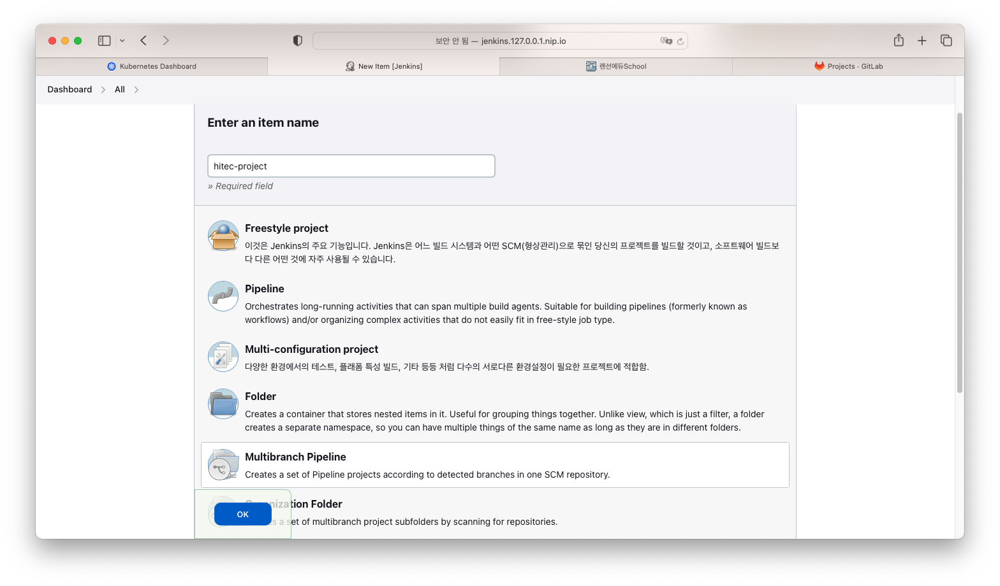   

branch sources 항목에서 add source 를 선택하고 git을 선택한다.    
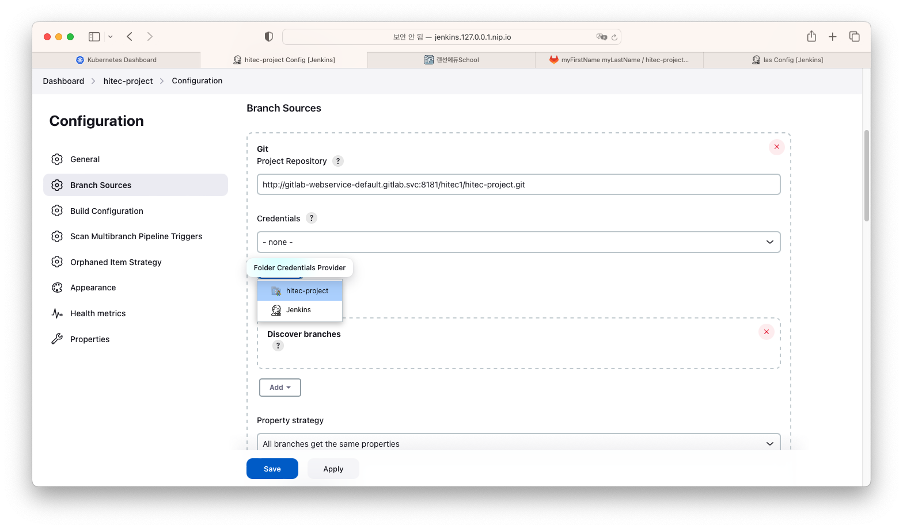    
> git project repository에 git 저장소의 주소를 입력한다.    
> 외부에서는 ingress를 통해서 접근하지만 jenkins와 gitlab은 kubernetes 내부에서 접근해야하기때문에 gitlab의 service 주소로 작성해 준다.    

gitlab의 username password로 credential을 생성한다.    
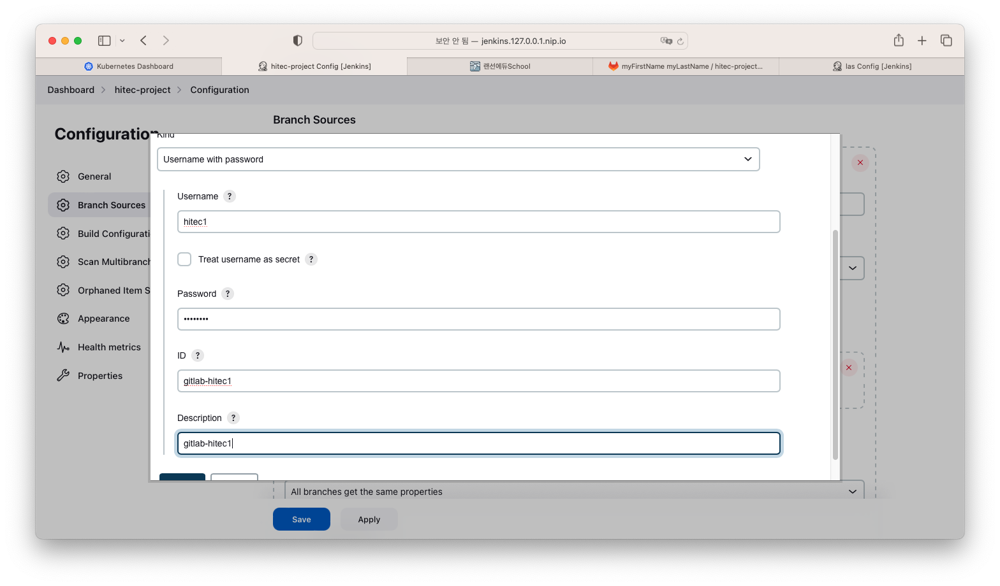   
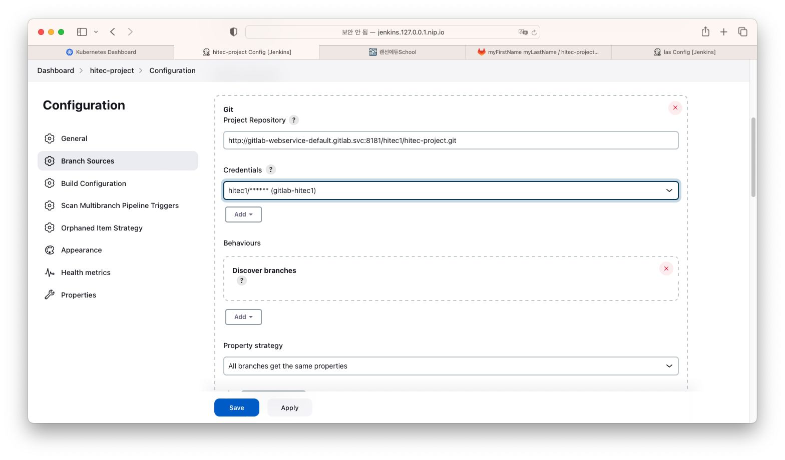   

자동으로 프로젝트를 스캔하게되며 브랜치를 찾는다.    
Jenkinsfile을 찾아서 빌드를 수행하게 된다.    
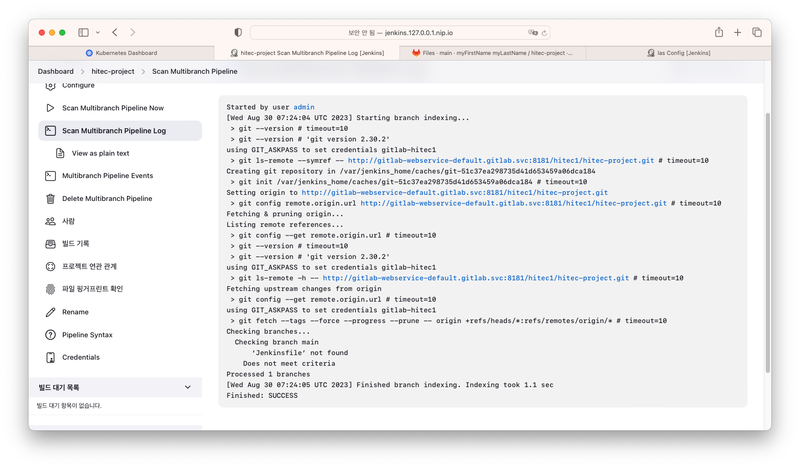   
> 소스상에 Jenkinsfile이 없기 때문에 빌드까지 수행되지는 않고있다.    

4. kubernetes build pod 스크립트 작성   
kubernetes에서 빌드하기 위해서는 빌드를 위한 Pod를 실행한다.    
pod 내에 빌드, 테스트 배포 등을 위한 컨테이너가 각각 실행되게 되며,   
컨테이너의 이름을 Jenkinsfile에서 사용하여 컨테이너의 툴을 사용한다.    

    어플리케이션 소스에 jenkins-builder.yaml 파일을 생성한다.    

    ```yaml
    apiVersion: v1
    kind: Pod
    metadata:
      labels:
        builder: jenkins-builder
    spec:
      containers:
        - name: git
          image: alpine/git
          command:
          - sleep
          args:
          - 99d
        - name: maven
          image: maven:3.6.2-jdk-8
          command:
          - sleep
          args:
          - 99d
          volumeMounts:
            - name: mavenvolume
              mountPath: /root/.m2
        - name: docker
          image: docker
          command:
          - sleep
          args:
          - 99d
          volumeMounts:
            - name: dockersock
              mountPath: /var/run/docker.sock
        - name: kubectl 
          image: lachlanevenson/k8s-kubectl
          command:
          - sleep
          args:
          - 99d
        - name: busybox
          image: busybox
          command:
          - sleep
          args:
          - 99d
      volumes:
        - name: dockersock
          hostPath:
            path: /var/run/docker.sock
        - name: mavenvolume
          persistentVolumeClaim:
            claimName: maven-pv-claim
    ```

    > git - 소스를 가져오기 위한 컨테이너    
    > maven - 메이븐 형태의 프로젝트를 빌드 및 테스트 하기 위한 컨테이너 (mavenvolume - 라이브러리를 캐싱)   
    > docker - docker 명령어를 실행하기위한 컨테이너. 빌드 및 푸쉬 등 (dockersock - host 의 docker daemon을 쉐어하기 위함)    
    > kubectl - kubernetes 명령어를 실행하기 위한 컨테이너    
    > busybox - 리눅스 명령어를 실행하기 위한 컨테이너   
    
    > 젠킨스 실행 중 수행이 필요한 툴이 있을 경우 컨테이너로 추가해서 사용할 수 있다.    

5. Jenkinsfile 작성   
젠킨스에서 빌드 및 테스트 등의 작업을 수행하기 위한 파이프라인 스크립트   

    어플리케이션 소스에 Jenkinsfile 이름의 파일을 생성한다.    
    ```
    pipeline {
        agent { 
            kubernetes {
                yamlFile 'Jenkins-builder.yaml'
            } 
        }
        stages {
            stage('BUILD') {
                steps {
                    container('maven') {
                        sh 'mvn package -DskipTests'
                    }
                }
            }
            stage('Dockernizer') {
                steps {
                    container('docker') {
                        sh 'docker build --build-arg APP_FILE=target/*.jar -t localhost:5000/hitec:0.0.1 .'
                    }
                }
            }
            stage('Docker Push') {
                steps {
                    container('docker') {
                        sh 'docker push localhost:5000/hitec:0.0.1'
                    }
                }
            }
        }
    }
    ```

    > 예제는 소스를 빌드하고 컨테이너 이미지로 빌드한 후 registry로 올리게 되어 있다.    
    > Jenkinsfile 파이프라인 생성 규칙 중 declarative 방식으로 작성하였다.    
    > agent 에 kubernetes를 설정하고 빌드가 수행 될 Pod 를 생성하는 스크립트의 경로를 지정한다.    
    > 툴 별 실행하기 위한 container 의 이름으로 지정하고 툴의 명령어를 수행한다.    

6. 프로젝트 스캔 및 빌드   
    프로젝트에서 Scan Multibranch Pipeline Now 를 클릭    
    스캔을 수행 한 후 가운데에 브랜치(main branch)이름으로 항목이 생성됨   
    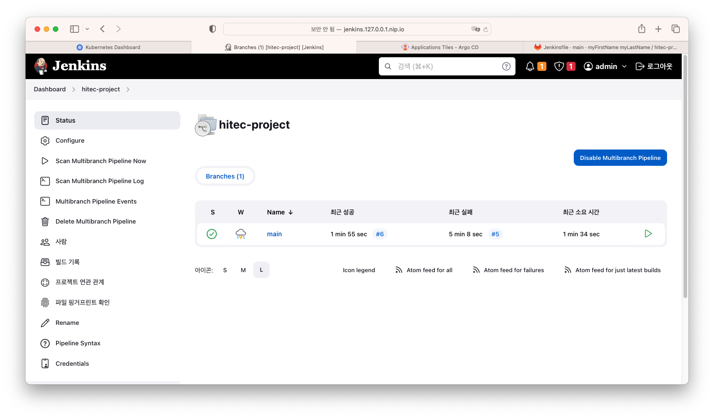   

    항목을 선택하면 내부에서 프로젝트가 성공적으로 빌드 된 것을 확인 할 수 있음   
    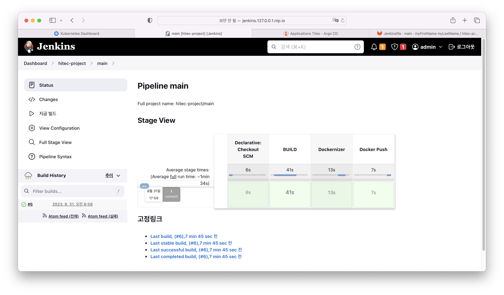  

    > scan multibranch pipeline now 를 통해서 새로운 브랜치를 프로젝트로 등록할 수 있으며,   
    > 변경 되었을 경우 빌드를 수행 할 수 있다.    
