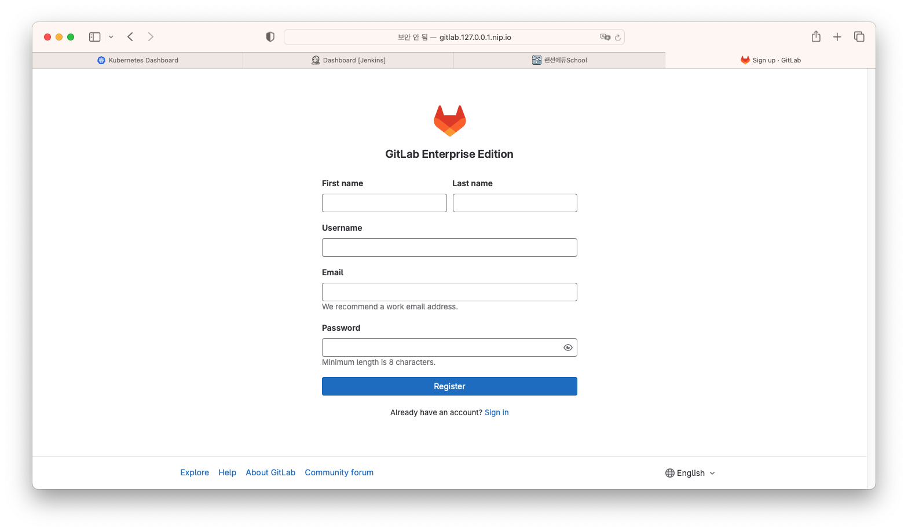
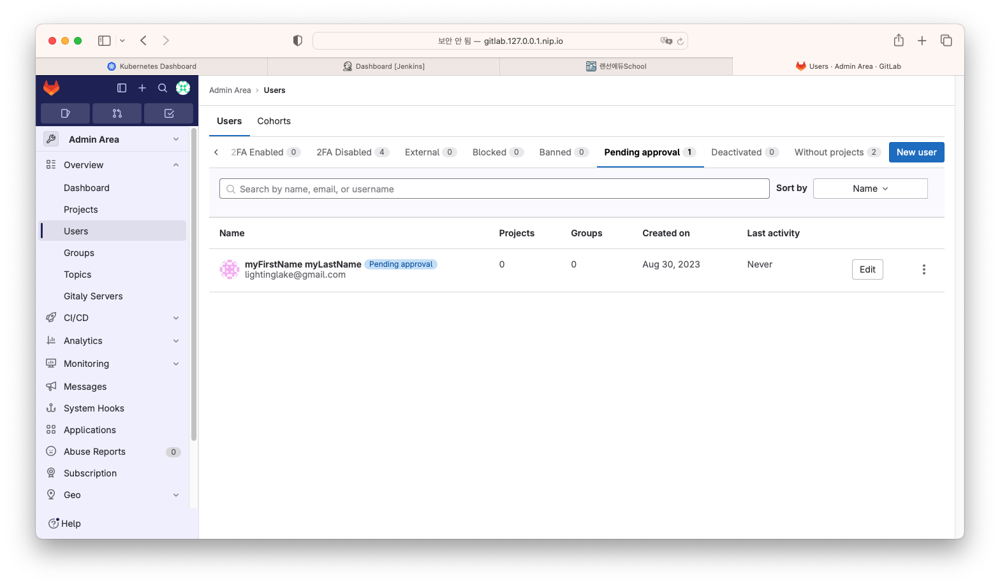
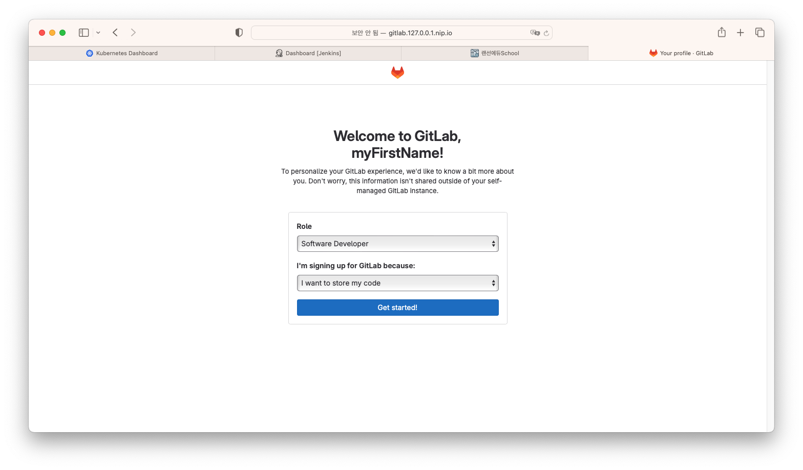
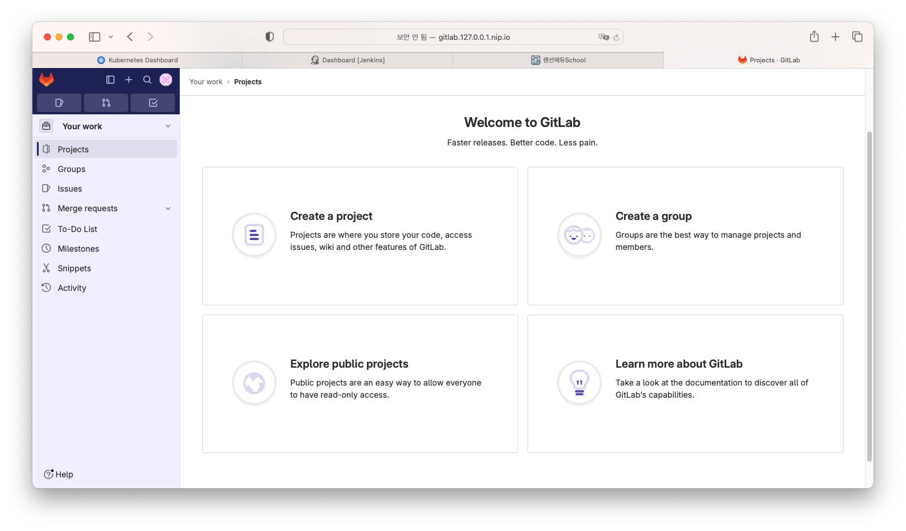
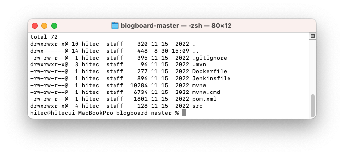
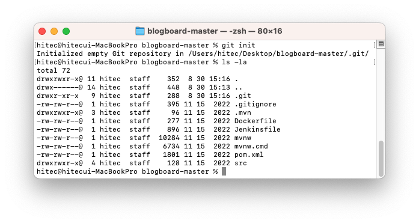
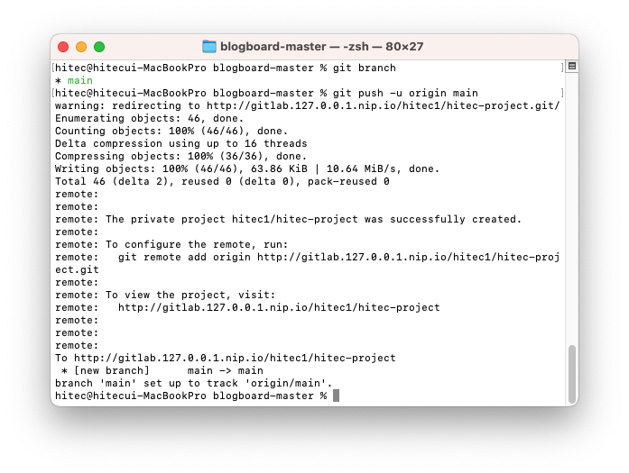
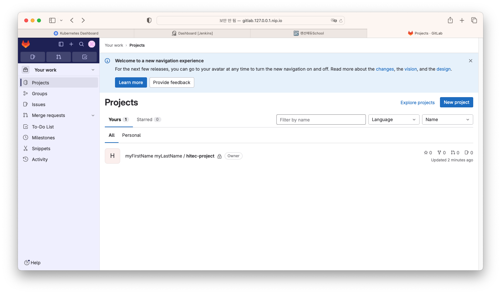

# gitlab 소스 푸쉬

## minikube 에 설치되어 있는 gitlab에 소스를 push 
로컬 PC에 개발되어 있는 소스를 gitlab에 올린다.    

1. gitlab 계정 만들기   
    1. gitlab 로그인 화면에서 register now 를 클릭한다.    
       
    2. 항목들을 모두 채운 후 register를 클릭   
    3. root로 로그인 -> Admin Area -> Users 메뉴 -> pending approvals 탭에서 새로가입한 유저 approval   
       
        > register 및 로그인 방법은 Admin Area에서 변경할 수 있음    
    4. 로그인 화면에서 회원가입 한 username password를 입력하고 로그인   
       
        > Role을 설정하고 로그인 (처음 로그인 할때만 나옴)
       
        > 아무 프로젝트도 없는 초기화면이 나옴   
    

2. 로컬PC에 있는 소스 올리기   
    gitlab UI를 통해서 프로젝트를 생성할 수도 있고, 다른 gitlab 에서 import 할 수도 있으며, 여러 가지 방법이 있지만 여기서는 local PC에 있는 프로젝트를 올려보려고 함   

    1. 로컬PC의 소스 확인    
       
    > 로컬PC에 git으로 정의되지 않은 java 프로젝트 확인    
    2. git 저장소 정의   
    git init 명령어를 통해 git 저장소로 정의   
    ```
    git init
    ```
       
    > .git 디렉토리가 새로 생성된 것을 확인    
    3. 최초 커밋 설정   
    ```
    git add .
    git commit -m "init"
    ```
    git 저장소에 최초의 커밋을 설정   
    4. git remote 설정   
    설치 된 gitlab 으로 push 하기 위해 remote를 설정    
    ```
    git remote add origin <gitlaburl>/<username>/<projectname>
    ex) git remote add origin http://gitlab.127.0.0.1.nip.io/hitec1/hitec-project
    ``` 
    5. source push 
    지정한 remote로 커밋한 소스를 push   
    ```
    git push -u origin main
    ```
       

    6. gitlab 웹에서 확인   
    gitlab에 다시 로그인 해보면 방금 push한 프로젝트가 생성되어있는 것을 확인 할 수 있다.    
       


# minikube Jenkins 빌드     

## kubernetes에서 Jenkins 로 빌드 설정   
kubernetes에 설치되어 있는 Jenkins에서 소스를 빌드하는 방법을 설명한다.     
kubernetes에서 pod를 생성하여 pod 내 컨테이너를 활용하여 빌드 및 명령어를 수행한다.    

1. kubernetes plugin 설치    
kubernetes 환경에서 빌드를 수행하기 위해서 kubernetes plugin 을 설치해야한다.    
Jenkins 관리 -> Plugins -> Available plugins 화면에서 kubernetes 검색   
   
설치 후 재기동 체크박스를 통해 설치 후 젠킨스 재기동   
   
2. jenkins cloud 설정   
kubernetes에 연결해서 빌드를 수행하기 위한 설정   
Jenkins 관리 -> Nodes and Clouds 화면에서 좌측의 Clouds 선택    
   
cloud를 생성하고 kubernetes의 이름만 설정한다.    
   
    > 동일 kubernetes에 설치가 되어 있기때문에 다른 설정은 생략   
3. multibranch pileline 잡 생성   
jenkins의 job을 생성하는 방법은 여러가지가 있다.    
여기서는 브랜치별로 다르게 빌드할 수 있게 파이프라인을 작성할 수 있는 multibranch pipeline 으로 생성한다.    
   

branch sources 항목에서 add source 를 선택하고 git을 선택한다.    
    
> git project repository에 git 저장소의 주소를 입력한다.    
> 외부에서는 ingress를 통해서 접근하지만 jenkins와 gitlab은 kubernetes 내부에서 접근해야하기때문에 gitlab의 service 주소로 작성해 준다.    

gitlab의 username password로 credential을 생성한다.    
   
   

자동으로 프로젝트를 스캔하게되며 브랜치를 찾는다.    
Jenkinsfile을 찾아서 빌드를 수행하게 된다.    
   
> 소스상에 Jenkinsfile이 없기 때문에 빌드까지 수행되지는 않고있다.    

4. kubernetes build pod 스크립트 작성   
5. Jenkinsfile 작성   
6. 프로젝트 스캔 및 빌드   
7. 빌드 확인   