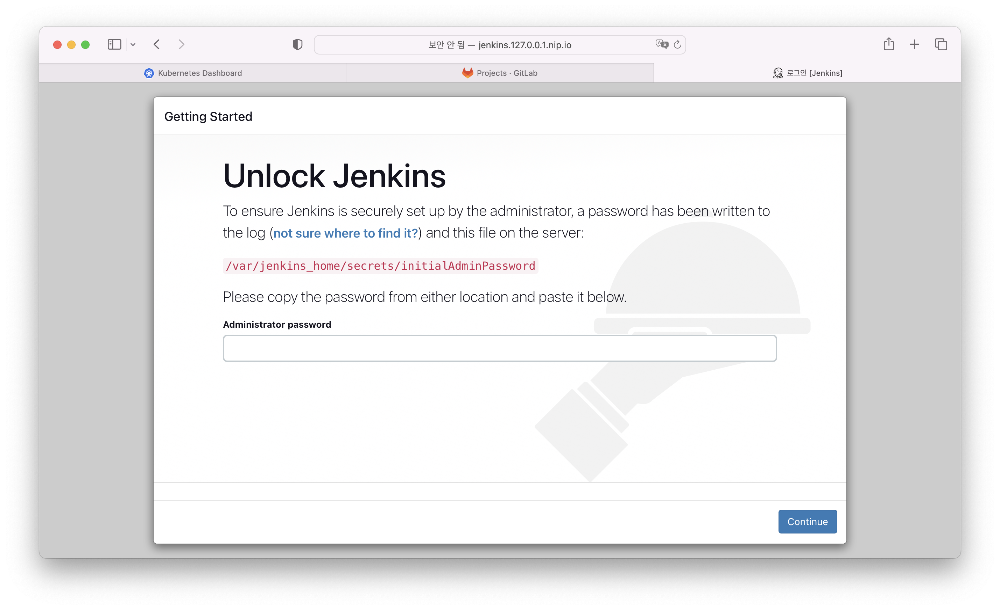

# minikube Jenkins 설치 

## yaml script를 통해 jenkins 설치 (출처 : [jenkins install][jenkins install]  )

   [jenkins install]: https://www.jenkins.io/doc/book/installing/kubernetes/ "Jenkins install"     

1. script 가져오기      
    로컬PC의 적당한 위치에서 git을 통해 script 파일을 가져온다.   
    ```
    git clone https://github.com/scriptcamp/kubernetes-jenkins
    ```
2. namespace 생성   
    namespace.yaml 파일에 설정이 되어 있으며 namespace 이름은 devops-tools로되어 있다.    
    namespace를 변경하고자 할 경우 metadata.name의 값을 변경하고, 다른 yaml파일의 namespace항목도 함께 변경해 준다.    
    ```
    kubectl apply -f namespace.yaml
    ```

3. serviceAccount 생성   
    jenkins는 kubernetes에 대한 권한이 필요하다.    
    cluster의 콤포넌트를 모두 관리할 수 있는 'jenkins-admin' clusterRole 을 생성한다.    
    'jenkins-admin' serviceAccount를 생성 한 후 clusterRole 을 serviceAccount에 bind한다.    
    권한을 가진 serviceAccount는 Deployment에서 사용하게 된다.    
    ```
    kubectl apply -f serviceAccount.yaml
    ```
    > 필요에 따라 필요한 권한만 부여할 수 있다.    

4. volume 생성   
    jenkins data의 영속성을 위해서 persistVolume으로 생성한다.    
    파일 중 'woker-node01' 부분은 실제 node의 이름으로 대체한다.    
    Node의 이름은 다음 명령어로 알 수 있다.      
    ```
    kubectl get nodes
    ```
   
    minikube 에서는 'minikube'가 이름이다.    
    ```
    kubectl apply -f volume.yaml
    ```

5. deployment 생성   
    application을 생성한다.    
    ```
    kubectl apply -f deployment.yaml
    ```
    liveness, readiness로 정상 동작 여부를 모니터링한다.     
    앞에서 생성한 persisvolume 은 /var/jenkins_home 으로 mount 한다.    
    포트는 웹 화면을 위한 8080과 slave 와의 jnlp 통신을 위한 50000 번이 필요하다.    

6. service 생성 (NodePort)    
    예제의 service는 NodePort 타입으로 생성하여 Node를 통해 바로 서비스로 연결하려고 하였다.    
    
    gitlab 설치때 사용한 ingress를 사용하고자 한다면 7번 방법으로 할 수 있다    
    
    노트 포트를 통해 바로 접근하고자한다면 아래와 같이 하면 된다.    
    서비스를 적용 한 후
    ```
    kubectl apply -f service.yaml
    ``` 
    
    minikube에서 service에 접급하기 위한   
    ```
    minikube service jenkins-service
    ```
    명령어를 통해 minikube 의 서비스에 접근할 수 있다. 

7. ingress, service(clusterIP) 생성  
    service.yaml 파일을 clusterIP 타입으로 수정한다.    
    ```yaml
    apiVersion: v1
    kind: Service
    metadata:
        name: jenkins-service
        namespace: devops-tools
        annotations:
            prometheus.io/scrape: 'true'
            prometheus.io/path:   /
            prometheus.io/port:   '8080'
    spec:
        selector:
            app: jenkins-server
        ports:
            - name: http
              port: 8080
              targetPort: 8080
            - name: jnlp
              port: 50000
              targetPort: 50000
    ```

    새로 ingress를 생성한다.    
    ingress.yaml 
    ```yaml
    apiVersion: networking.k8s.io/v1
    kind: Ingress
    metadata:
        name: jenkins-server-http
        namespace: devops-tools
    spec:
        rules:
        - host: jenkins.127.0.0.1.nip.io
          http:
            paths:
            - path: /
                pathType: Prefix
                backend:
                  service:
                    name: jenkins-service
                    port:
                      number: 8080
    ```
    > host는 gitlab설치와 유사하게 적용하였다.    

    ```
    kubectl apply -f service-ingress.yaml
    kubectl apply -f ingress.yaml
    ```
    > 서비스와 인그레스를 적용한다.     

8. 설치확인   
    http://jenkins.127.0.0.1.nip.io 로 접근   
       

    초기 비밀번호는 pod의 설치 로그에서 확인 할 수 있다.    
    ```
    kubectl get pod --namespace devops-tools
    ```
    jenkins의 Pod를 확인 한 후    
    ```
    kubectl logs <jenkins-podname> --namespace=devops-tools
    ```
    로 로그를 확인 할 수 있다.    
    로그의 아래쪽 initialAdminPassword를 확인할 수 있다.    