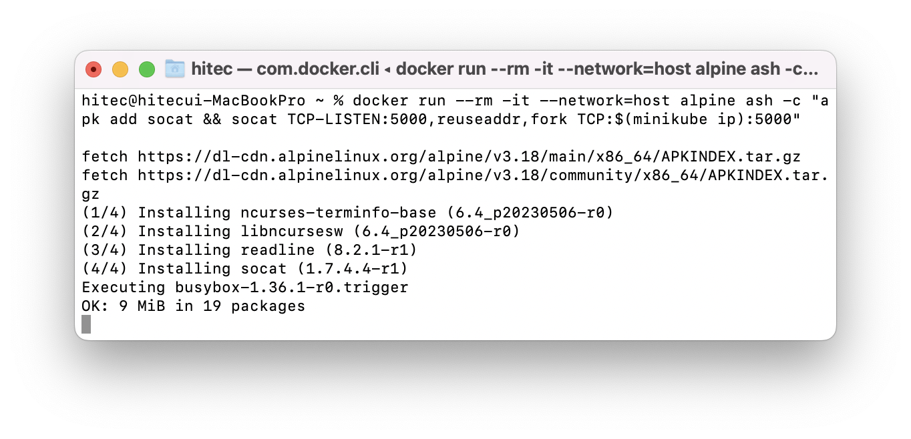
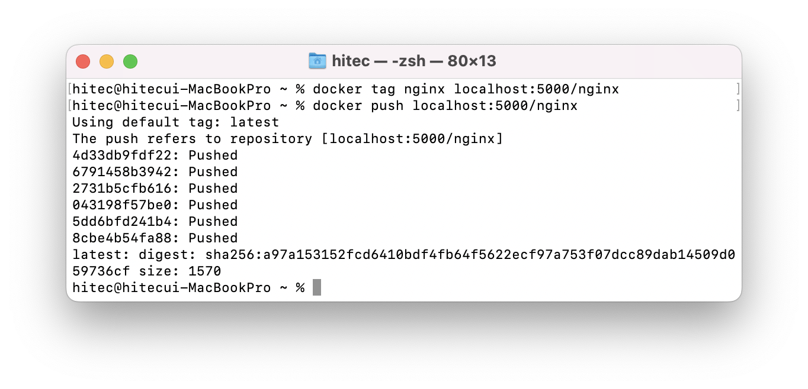

# Docker registry   
Docker 이미지를 저장하고 제공하는 registry서버를 minikube에서는 애드온으로 제공한다.    
따로 registry, nexus 혹은 gitlab설치 시 같이 설치되는 registry를 사용할 수도 있다.    

## minikube docker registry 

1. minikube registry addons  (출처 : [minikube registry][minikube registry]  )

   [minikube registry]: https://minikube.sigs.k8s.io/docs/handbook/registry/ "Minikube registry"   

    ```
    minikube addons enable registry
    ```
    > https 통신이 아닌경우 docker 설정에 insecure-registry 설정을 해주어야한다.    
    > minikube의 경우 기동 시에 옵션으로 설정할 수 있게되어 있으며 10.0.0.0/24 로 기본 설정한다.  
    > minikube 내부에서는 localhost:5000으로 이미지를 push pull할 수 있다. 하지만 로컬PC에서는 서버에 접근을 하지 못한다.     

2. 로컬PC에서 minikube로 이미지 push    
    내가 작업하고 있는 PC에서 이미지를 당겨오거나 push하고자 할 경우가 있다.    
    pc 에서 아래 명령어를 입력 할 경우 로컬 PC에서 이미지를 올리거나 받을 수 있다. 
    ```
    docker run --rm -it --network=host alpine ash -c "apk add socat && socat TCP-LISTEN:5000,reuseaddr,fork TCP:$(minikube ip):5000"
    ```
       
    > 실행 상태로 유지한다. 


       
    localhost서버에 5000 포트로 registry 서버가 활성화 되어 있다.    
    이미지예시는 nginx 이미지를 localhost:5000/nginx로 태깅 후 minikube의 registry서버로 푸쉬    
