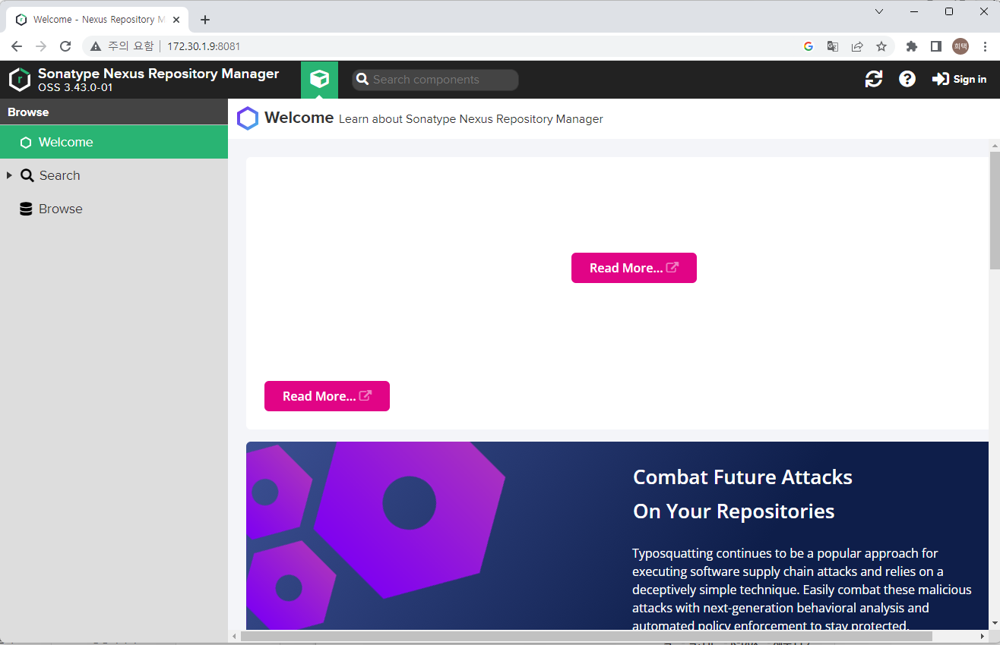

# Nexus 설치   

## nexus install with Docker

nexus를 Docker로 기동 (출처 : [nexus docker hub][nexus docker]  )

   [nexus docker]: https://hub.docker.com/r/sonatype/nexus3 "Nexus Docker"   

1. host에 nexus data 디렉토리를 만든다.   
    ```sh
    mkdir <nexus data directory>
    ex) mkdir /home/ubuntu/devops/nexus-data

    sudo chown -R 200:200 <nexus data directory>
    ```
    > user id 를 200 으로 변경한다. 컨테이너 내부의 nexus 사용자의 user id 가 200   

2. docker 로 nexus를 실행한다.    
    ```sh
    sudo docker run -d -p 8081:8081 -p 5000:5000 -p 5001:5001 -p 5002:5002 --name nexus -v /home/ubuntu/devops/nexus-data:/nexus-data sonatype/nexus3
    ```
    > port : 8081(기본포트), 5000-5002(docker registry에서 사용)   
    > volume : 앞에서 생성한 nexus data directory   

3. 설치 확인 및 로그인   
       

    * username : admin
    * password 
        ```sh
        sudo docker exec -it nexus /bin/bash
        cat /nexus-data/admin.password
        ```

4. 비밀번호 변경 및 초기 설정   
    1. 초기 설정 팝업을 통해 비밀번호 변경   
    2. anonymous access 설정    
        * Enable anonymous access - 인증절차 없이 검색하고 다운로드 할 수 있음
        * disable anonymous access - 인증절차를 통해 검색 및 다운로드 가능   