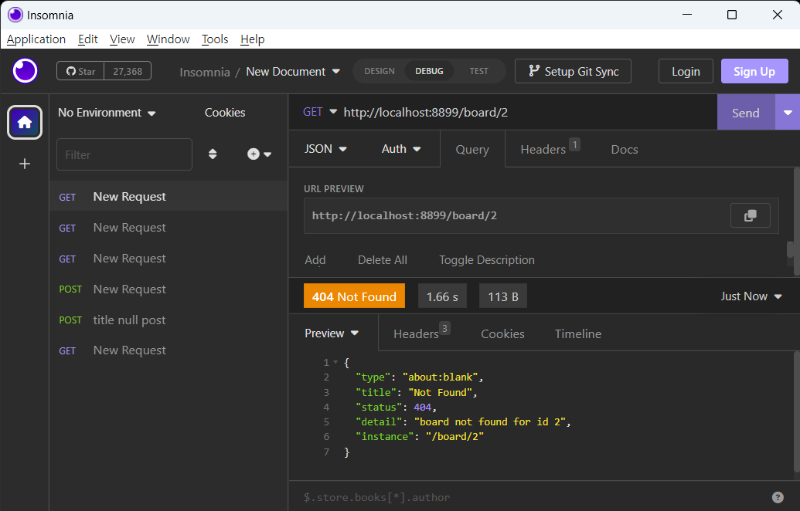

# Error 처리 세팅 #   
Spring 에서는 Controller 에서 Exception 이 발생했을 때    
Exception 별로 Handling 을 할 수 있도록 기능을 제공하고 있다.    

## Sample Code ##
특정한 상황에 발생하는 Exception 을 만든다.        
```java
public class BoardNotFoundException extends RuntimeException{
    public BoardNotFoundException() {
        super();
    }
    
    public BoardNotFoundException(String message) {
        super(message);
    }
}
```
> 예제는 Board 가 없을 때 발생하도록 하는 BoardNotFoundException을 만들었다.    

Controller 에서 발생한 Exception을 처리할 수 있는  ExceptionHandler를 만든다. 
```java
@RestControllerAdvice
public class BoardExceptionHandler {
    
    @ExceptionHandler({ BoardNotFoundException.class })
    protected ErrorResponse handleServerException(BoardNotFoundException ex){
        return ErrorResponse.builder(ex, HttpStatus.NOT_FOUND, ex.getLocalizedMessage()).build();
    }

    /**
     * Validation 에서 발생하는 Exception
     * @param ex
     * @return
     */
    @ExceptionHandler(MethodArgumentNotValidException.class)
    public ErrorResponse handleValidationExceptions( MethodArgumentNotValidException ex) {
        String errorMessage = ex.getBindingResult().getFieldErrors().stream().map(err->err.getDefaultMessage()).collect(Collectors.joining(", "));
        return ErrorResponse.builder(ex, ex.getStatusCode(), errorMessage).title("request argument not valid").build();
    }
    
    /**
     * 인지하지 못한 예외에 대한 처리
     * 예외에 대해 최대한 찾아서 Exception 별로 처리를 해야함
     * 
     * @param ex
     * @return
     */
    @ExceptionHandler({ Exception.class })
    protected ErrorResponse handleServerException(Exception ex) {
        return ErrorResponse.builder(ex, HttpStatus.INTERNAL_SERVER_ERROR, ex.getLocalizedMessage()).build();
    }

}

```
> @RestControllerAdvice 를 통해 Exception을 핸들링하는 빈으로 설정한다.    
> @ExceptionHandler를 통해 해당하는 Exception에 대해 처리하는 메소드를 만든다.    
> MethodArgumentNotValidException 은 spring validation 에서 발생하는 Exception이다. 
> BoardNotfoundException 에 대한 처리로 ErrorResponse를 리턴한다. (Spring에서 작성되어 있으며 RFC 7807 을 따른다고 한다.)


Service 파일에서 Board 가 없을 때 BoardNotFoundException을 throw 하도록 수정하였다.    
```java
public Board getBoard(Long id){
    Optional<Board> boardOpt = boardRepository.findById(id);
    return boardOpt.orElseThrow(() -> new BoardNotFoundException("board not found for id " + id));
}
```

Controller 에서 Board Id로  Board를 조회하는 메소드 추가   
```java
@GetMapping("/board/{id}")
public BoardDTO getBoard(@PathVariable Long id) throws Exception{
    Board board = boardService.getBoard(id);
    return BoardDtoMapper.MAPPER.boardToBoardDto(board);
}
```

## Test ##
   
> board로 요청할 때 data가 없는 2번 ID를 요청했을 때    
> 404 httpstatus 가 오며 ErrorResponse 정보가 함께 넘어오게 된다.    
