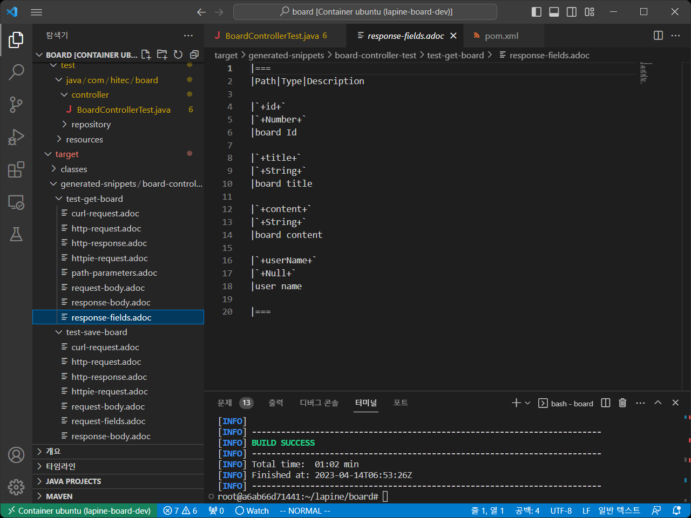
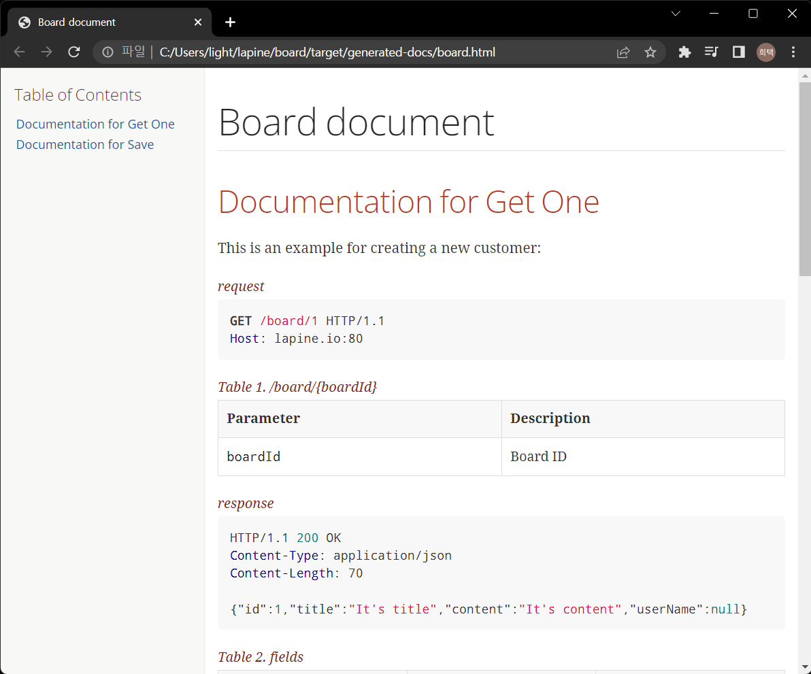

# RestDocs 세팅 #   
Web 요청은 URL 과 요청 파리미터, 컨텐트 타입, 결과 응답 내용등이 포함되어 있다.    
그리고 이러한 내용을 Client 쪽에 제공해야 서버에 대해 요청하는 개발을 할 수 있다.    

문서를 일일이 만들어서 엑셀이나, wiki 등의 문서로 제공할 수도 있다.    
하지만 자동으로 문서를 생성해 주는 방법들이 있다.     
swagger가 유명하다.    
하지만 swagger 는 서버에서 제공하는 api와 함께 문서파일이 제공된다.    
그리고 controller 소스에 여러 정보를 기입하게된다.(동작과 관련없는 코드가 들어간다는게 마음에 들지 않는다.)

그래서 RestDocs 를 선택하였다.   

설정해야할 사항이 좀 더 많고 유닛테스트를 통과해야만 문서가 나오지만   
html 파일로 단독으로 나온다는 점과 여러가지 정보를 테스트 소스로 뺄 수 있다는 점에서 선택하였다.    


## 메이븐 설정 ##

pom.xml 의 dependency에 추가한다.            
```xml
<!-- usning restdocs for api document-->
<dependency>
  <groupId>org.springframework.restdocs</groupId>
  <artifactId>spring-restdocs-mockmvc</artifactId>
  <scope>test</scope>
</dependency>
```

pom.xml 에 plugin 에 추가한다.    
```xml
<!-- api document setting (target/generated-snippet, target/generated-doc) -->
<plugin>
  <groupId>org.asciidoctor</groupId>
  <artifactId>asciidoctor-maven-plugin</artifactId>
  <version>2.2.1</version>
  <executions>
    <execution>
      <id>generate-docs</id>
      <phase>prepare-package</phase>
      <goals>
        <goal>process-asciidoc</goal>
      </goals>
      <configuration>
        <backend>html</backend>
        <doctype>book</doctype>
      </configuration>
    </execution>
  </executions>
  <dependencies>
    <dependency>
      <groupId>org.springframework.restdocs</groupId>
      <artifactId>spring-restdocs-asciidoctor</artifactId>
      <version>${spring-restdocs.version}</version>
    </dependency>
  </dependencies>
</plugin>		
```
> 가장 기본적인 설정을 따르고 있으며, 문서위치, 형식 등을 설정을 통해 변경할 수 있다.    

## Sample Code ##
WebMvcTest 를 수행하는 테스트 코드에서 추가로 내용을 작성한다.    
```java

@WebMvcTest
@AutoConfigureRestDocs(uriScheme = "https", uriHost = "lapine.io", uriPort = 80)
public class BoardControllerTest {

    ObjectMapper objectMapper = new ObjectMapper();
    
    @Autowired
    MockMvc mockMvc;

    @MockBean
    private BoardService boardService;

    @Test
    @DisplayName("게시글 1건 조회")
    void testGetBoard() throws Exception{
        Board board = new Board();
        board.setId(1L);
        board.setTitle("It's title");
        board.setContent("It's content");

        given(boardService.getBoard(1L)).willReturn(board);

        mockMvc.perform(get("/board/{boardId}", 1))
            .andExpect(status().isOk())
            .andExpect(jsonPath("$.id").value(1L))
            .andDo(document("{class-name}/{method-name}", 
                pathParameters( // path 파라미터 정보 입력
                        parameterWithName("boardId").description("Board ID") 
                ),
                responseFields(
                    fieldWithPath("id").description("board Id"), 
                    fieldWithPath("title").description("board title"),
                    fieldWithPath("content").description("board content"),
                    fieldWithPath("userName").description("user name")
                )
            ));

    }

    @Test
    @DisplayName("게시글 작성")
    void testSaveBoard() throws Exception{
  
        Board board = new Board();
        board.setTitle("It's title");
        board.setContent("It's content");

        given(boardService.saveBoard(any(Board.class))).will( (InvocationOnMock invocation) -> {
            Board board1 = (Board)invocation.getArgument(0);
            board1.setId(2L);
            return board1;
        });

        mockMvc.perform(post("/board")
            .content(objectMapper.writeValueAsString(new BoardDTO(0, "It's title", "It's Content", "hhh")))
            .contentType("application/json")
            )
            .andExpect(status().isCreated())
            .andExpect(jsonPath("id").value(2L))
            .andDo(document("{class-name}/{method-name}",
                requestFields(
                    fieldWithPath("id").description("board id"),
                    fieldWithPath("title").description("board title"),
                    fieldWithPath("content").description("board content"),
                    fieldWithPath("userName").description("username")
                ),
                responseFields(
                    fieldWithPath("id").description("board Id"), 
                    fieldWithPath("title").description("board title"),
                    fieldWithPath("content").description("board content"),
                    fieldWithPath("userName").description("user name")
                )
            ));

    }
}
```
> @AutoConfigureRestDocs를 통해 RestDocs 문서를 작성한다고 설정한다.    
> schema(http, https), uriHost(localhost, 호스트서버), uriPost(서비스포트) 를 설정한다   

> mockMvc 의 perform 실행 후 andDo 메소드를 통해 document를 등록한다.    
> document 는 {class-name}/{method-name} 으로 구분할 수 있도록 설정 하였다   
> 요청 시 설정하는 값, 응답 받은 값 등의 내역과 설명 등을 작성한다.    

## 문서 생성 ##
1. 테스트 단계에서 adoc 형태의 스티펫 생성   
```
mvn test
```
   

> target/generated-snippets  아래에 클래스 이름인 board-controller-test 아래에 함수 명인 test-get-board, test-save-board 아래에 adoc 파일이 생성된 것을 볼 수 있다.    
> request, paramter, body, response 등의 내용들이 각각의 파일에 작성이 되어 있다.    

2. 각각의 snippet을 묶어서 하나의 html 문서 파일로 만든다.    
> src 아래에 docs/asciidoc 디렉토리를 생성한 후    
> 문서를 합치고자 하는 이름의 adoc 파일을 생성한다.    

board.adoc 파일을 생성   
```
= Board document
:doctype: book
:icons: font
:source-highlighter: highlightjs
:toc: left
:toclevels: 2
:sectlinks:

== Documentation for Get One

This is an example for creating a new customer:

.request
include::{snippets}/board-controller-test/test-get-board/http-request.adoc[]

.path parameters
include::{snippets}/board-controller-test/test-get-board/path-parameters.adoc[]

.response
include::{snippets}/board-controller-test/test-get-board/http-response.adoc[]

.fields
include::{snippets}/board-controller-test/test-get-board/response-fields.adoc[]

== Documentation for Save

This is an example for creating a new customer:

.request
include::{snippets}/board-controller-test/test-save-board/http-request.adoc[]

.request field
include::{snippets}/board-controller-test/test-save-board/request-fields.adoc[]

.response
include::{snippets}/board-controller-test/test-save-board/http-response.adoc[]

.fields
include::{snippets}/board-controller-test/test-save-board/response-fields.adoc[]
```
> snippet 에 생성된 파일들 중 API 정의에 필요한 파일들을 include  해서 하나의 파일로 생성   

3. 패키지 단계에서 html 문서 생성   
```
mvn package
```
> target/generated-docs 아래에 docs/asciidoc 아래 만들었던 파일 이름으로 html 파일 생성   

   
> html 파일을 열었을 때 위와 같이 문서형태로 나오는 것을 확인 할 수 있다.    


## Rest Docs ##
* 주요 함수   
  * pathParameters - URL 의 path 형태로 넘겨지는 인자
  * queryParameters - URL 에 파리미터 형태로 넘겨지는 인자 
  * requestFields - 요청 데이터 
  * responseFields - 응답 데이터 

* 주요 인자 함수
  * parameterWithName - 인자의 파라미터 이름
  * fieldWithPath - json 형태 데이터의 필드

자세한 사항은 다음 참조    
[RestDocs](https://docs.spring.io/spring-restdocs/docs/current/reference/htmlsingle/ "RestDocs")     

