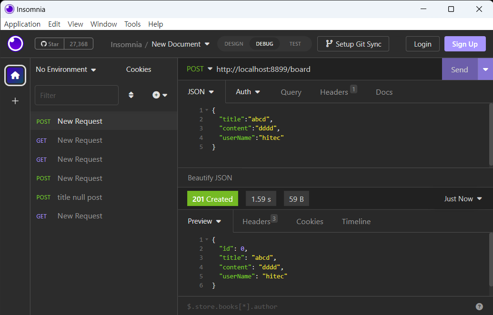

# Validation 세팅 #   
spring 에서 잘못 된 데이터에 대해서 유효성을 체크할 때 사용한다.    
유효성을 통과하지 못하면 BAD_REQUEST를 내며 error 처리를 한다.   
에러 처리(ExceptionHandler)에 대해서는 추후에 정리하도록 한다.    


## 메이븐 설정 ##  

pom.xml 파일에 dependency 추가
```xml
<dependency> 
	<groupId>org.springframework.boot</groupId> 
	<artifactId>spring-boot-starter-validation</artifactId> 
</dependency>
```

## Sample Source ##

보드 정보를 입력받는 DTO 클래스에   
@NotBlank, @Size 등의 어노테이션을 적용한다.    
```java
@Getter
@Setter
@AllArgsConstructor
public class BoardDTO {
    private long id;

	@NotBlank(message = "title is mandatory")
    @Size(message="title size 2 more", min = 2, max = 14)
    private String title;

	@NotBlank(message = "content is mandatory")
    @Size(message="content size 1 more", min = 1, max = 500)
    private String content;

    private String userName;
}
```

Post 메소드를 통해 BoardDTO를 입력받는 함수를 작성한다.   
BoardDTO를 받는 인자부분에 @Valid를 추가하여 어노테이션 유효성 체크를 한다.    
```java
@PostMapping("/board")
@ResponseStatus(HttpStatus.CREATED)
public BoardDTO saveBoard(@Valid @RequestBody BoardDTO boardDTO){
	return boardDTO;
}
```

## spring Validation ##
자세한 사항은 롬복 홈페이지 참조 [Hibernate validator Homepage](hhttps://docs.jboss.org/hibernate/validator/8.0/reference/en-US/html_single/#validator-gettingstartedttps://projectlombok.org/ "Hibernate validator Homepage")     

주요 어노테이션    
* @Null  // null만 혀용합니다.
* @NotNull  // null을 허용하지 않습니다. "", " "는 허용합니다.
* @NotEmpty  // null, ""을 허용하지 않습니다. " "는 허용합니다.
* @NotBlank  // null, "", " " 모두 허용하지 않습니다.
* @Email  // 이메일 형식을 검사합니다. 다만 ""의 경우를 통과 시킵니다
* @Pattern(regexp = )  // 정규식을 검사할 때 사용됩니다.
* @Size(min=, max=)  // 길이를 제한할 때 사용됩니다.
* @Max(value = )  // value 이하의 값을 받을 때 사용됩니다.
* @Min(value = )  // value 이상의 값을 받을 때 사용됩니다.
* @Positive  // 값을 양수로 제한합니다.
* @PositiveOrZero  // 값을 양수와 0만 가능하도록 제한합니다.
* @Negative  // 값을 음수로 제한합니다.
* @NegativeOrZero  // 값을 음수와 0만 가능하도록 제한합니다.
* @Future  // 현재보다 미래
* @Past  // 현재보다 과거
* @AssertFalse  // false 여부, null은 체크하지 않습니다.
* @AssertTrue  // true 여부, null은 체크하지 않습니다.

## Test ##
* 정상 요청
   
> 요청한 내역이 HttpStatus 201과 함께 그대로 리턴되었음을 볼 수 있다. 

* Validation 체크   
   
> BoardDTO 에는 title 의 Size 가 2 이상으로 설정되어 있다. 
> title 에 1글자만 입력한 경우 HttpStatus 400과 함께 error response 가 오게된다.    