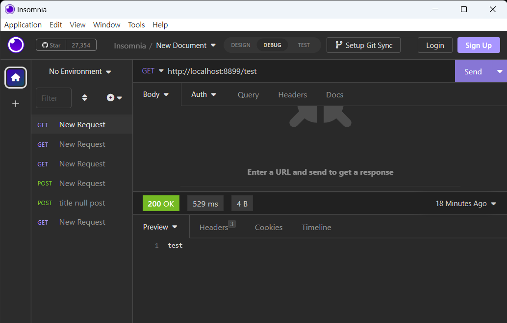

# WebMVC 세팅 #   

## 메이븐 설정 ##  

pom.xml 파일에 dependency 추가
```
<dependency>
	<groupId>org.springframework.boot</groupId>
	<artifactId>spring-boot-starter-web</artifactId>
</dependency>
```

## spring 설정 ##
spring 설정 파일은 src/resources에 위치한   
application.properties 혹은 application.yml 파일이다. 

```
server:
	port: 8899
	servlet:
		context-path: /
		encoding:
			charset: UTF-8
			enabled: true
			force: true
```
> 특별한 상황이 아니면 spring 에 대한 설정은 필요하지 않으며   
> 서버가 같이 기동하게 됨에 따라 서버의 설정을 일부 설정할 수 있다.    

## Web Sample ##

controller package 를 만든 후 기본 WebController 를 만든다.    
sample Controller 의 이름은 HitecController로 지정하고 HitecController.java  파일을 생성한다.    
```
@RestController
public class HitecController {

    @GetMapping("/test")
    public String getTest(){
        return "test";
    }
    
}
```
> @RestController 는 Controller bean 이며 return 결과를 response body로 하겠다는 어노테이션이다.    
> 여기서는 restful 한 서버를 만들기 위해 @RestController를 사용한다.   

## Test ##

Unit Test 는 추후에 설명하려고 한다.    
개발 과정에서 Test를 먼저 작성해야하지만 설명하려니 뭔가 있어야할 것 같아서....

Server를 기동한다. 
```
mvn spring-boot:run
```
api 테스트 툴로는 postman 이 유명하다.   
여기서는 insomnia 로 테스트 하고자 한다.    
   
> Get 메소드로 http://localhost:8899/test 로 요청해서 test 라는 String 을 정상적으로 받은 것을 확인 할 수 있다.    


이 설정만으로 웹 프로토콜을 사용할 수 있다.